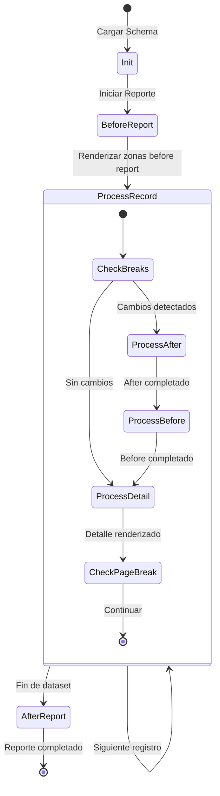

# Web Report Engine - Diseño para nilix

**Versión:** 1.2  
**Fecha:** 2026-02-22  
**Autor:** Análisis de arquitectura basado en NILIX RDL  
**Revisión:** Extensiones para múltiples datasources, interactividad y caso carta digital

---

## Introducción

Este documento describe el diseño del motor de reportes web para `nilix`, implementando un motor de reportes web moderno. El objetivo no es portar el código, sino **rediseñar el motor** entendiendo profundamente el modelo original.

---

## Hallazgos de la Gramática (No Documentados en REP-SPEC.md)

Durante el análisis de los archivos [`rgenpar.y`](../agent/specs/REP/report/rgenpar.y) y [`rgenlex.l`](../agent/specs/REP/report/rgenlex.l), se identificaron las siguientes construcciones del lenguaje RDL que no están documentadas o están parcialmente documentadas en REP-SPEC.md:

### 1. Cláusula `resetaccum`

```rdl
%zona(expr) if condicion resetaccum
```

**Hallazgo:** La cláusula `resetaccum` (token `T_RESETACCUM`) permite resetear acumuladores cuando se cumple una condición `if`. Esta cláusula **requiere** que exista una condición `if` previa en la misma zona. No está documentada en el manual de usuario pero aparece en la gramática.

**Caso de uso:** Resetear contadores parciales cuando se detecta una condición específica, sin esperar al corte de control natural.

**Integración en el flujo de renderizado:**

```typescript
// Durante el procesamiento de una zona con resetaccum
if (zone.resetAccum && zone.ifCondition) {
  const conditionMet = evaluateCondition(zone.ifCondition, state);
  if (conditionMet) {
    // Resetear todos los acumuladores asociados a esta zona
    const breakLevel = inferBreakLevel(zone);
    if (breakLevel) {
      state.accumulators.resetLevel(breakLevel);
    }
  }
}
```

**Importante:** `resetaccum` solo tiene sentido en zonas que:
1. Tienen una condición `if` (es obligatorio según la gramática)
2. Contienen expresiones con funciones de agregación de corte (`sum`, `avg`, etc.)
3. Se ejecutan en un contexto donde los acumuladores ya tienen valores

### 2. Orden de Condiciones `before`/`after`

**Hallazgo:** El parser impone un orden estricto: todas las condiciones `before` deben aparecer antes que las condiciones `after` en una misma zona. La función [`checkCond()`](../agent/specs/REP/report/rgenpar.y:759) valida esto y genera error `COND_ORDER` si se viola.

```rdl
// VÁLIDO
%zona() before depto after page

// INVÁLIDO - genera error
%zona() after page before depto
```

### 3. Expresiones con Alias (`expr : id`)

**Hallazgo:** La sintaxis de expresiones permite definir aliases que pueden referenciarse posteriormente:

```rdl
%zoneA(a : c1, a : c2)
```

Esto crea dos entradas distintas en `%fields` para la misma expresión `a`, permitiendo diferentes formatos de salida para el mismo valor. El alias debe ser único (error `ALIAS_CONFLICT` si se duplica).

### 4. Patrones de Campo WYSIWYG en el Lexer

El analizador léxico reconoce patrones visuales específicos que definen el tipo y formato del campo:

| Patrón Lexer | Tipo | Ejemplo Visual |
|---|---|---|
| `__\/__\/___?_?` | `TY_DATE` | `__/__/__` o `__/__/____` |
| `__:__(:__)?` | `TY_TIME` | `__:__` o `__:__:__` |
| `-?_*______e` | `TY_FLOAT` (exponencial) | `_______e` |
| `-?_*______f` | `TY_FLOAT` (redondeado) | `_______f` |
| `_+\?` | `TY_BOOL` | `_?` |
| Patrones numéricos con `,` y `.` | `TY_NUMERIC` | `__,___.__` |
| `_+` | `TY_STRING` | `______` |

**Caracteres especiales:**
- `-` al inicio indica campo con signo
- `,` indica separador de miles
- `.` indica decimales
- `#` indica check digit con separador slash

### 5. Variables de Entorno en Expresiones

**Hallazgo:** La sintaxis `$varname` se expande al valor de la variable de entorno en tiempo de ejecución. En el lexer se transforma a `${varname}` para evaluación posterior.

### 6. Límites del Sistema (de rgen.h)

```c
#define MAX_FIELDS   256
#define MAX_ACCUMS   256
#define MAX_ZONES    128
#define MAX_SCHEMAS  4
```

---

## 1. Mapeo de Conceptos: RDL → Web

### 1.1 Zona (`Zone`) → Componente React / Bloque de Renderizado

En RDL, una **zona** es la unidad fundamental de composición visual. Cada zona tiene un nombre, una lista de expresiones/parámetros, condiciones de impresión, y un template visual (el "dibujo" WYSIWYG). En la arquitectura web, la zona se mapea a un **componente React** que encapsula:

- **Template:** El layout visual de la zona (tradicionalmente caracteres fijos, ahora CSS Grid/Flexbox)
- **Bindings:** Las expresiones que resuelven valores desde el dataset
- **Condiciones:** Lógica de visibilidad basada en control breaks y predicados `if`
- **Estado de agregación:** Accumuladores locales si la zona contiene funciones como `sum()` o `avg()`

La diferencia clave es que en RDL la zona es **imperativa** (se imprime cuando se llama a `DoReport()`), mientras que en React es **declarativa** (se renderiza cuando su estado/props cambian).

### 1.2 `%fields` → Schema de Tipos + Binding de Datos

La sección `%fields` en RDL define los campos que alimentan el reporte, incluyendo su tipo, longitud, decimales, y opcionalmente su origen en la base de datos. En la arquitectura web, esto se mapea a:

1. **TypeScript Interface/Type:** Define la forma del registro de entrada
2. **Field Schema:** Metadata que describe formato, validación, y transformaciones
3. **Data Binding:** Mapeo entre columnas del dataset y expresiones en las zonas

A diferencia del modelo original donde los campos se pasan secuencialmente a `doreport`, el modelo web usa **objetos estructurados** (JSON) con nombres de propiedad explícitos.

### 1.3 `before`/`after` field (Control Break) → Hook de Ciclo de Vida / Efecto Reactivo

El **control break** es el mecanismo central del motor de reportes. Una zona con `before campo` se imprime antes de que cambie el valor de ese campo; `after campo` se imprime después del cambio. Esto permite agrupar registros y calcular subtotales.

En la arquitectura web, esto se modela como:

```typescript
interface ControlBreak {
  field: string;           // Campo a monitorear
  onBefore?: ZoneRef;      // Zona a ejecutar antes del cambio
  onAfter?: ZoneRef;       // Zona a ejecutar después del cambio
}
```

Durante la iteración del dataset, el motor detecta cambios de valor y dispara los efectos correspondientes. Esto es análogo a un `useEffect` que observa cambios en una propiedad específica del registro actual.

### 1.4 `before`/`after` page/report → Layout Regions con Lógica de Agregación

Las condiciones especiales `before page`, `after page`, `before report`, y `after report` definen zonas de encabezado y pie:

- **before report:** Encabezado global (título del reporte, parámetros)
- **after report:** Pie global (totales finales, firmas)
- **before page:** Encabezado de página (número de página, fecha)
- **after page:** Pie de página (subtotales acumulados, continuación)

En web, estas se mapean a **regiones de layout** que se renderizan en puntos específicos del flujo de paginación virtual. La paginación web puede ser:

1. **Scroll infinito:** Las zonas `before/after page` se renderizan en posiciones fijas (sticky headers/footers)
2. **Paginación real:** Se calculan quiebres de página y se insertan las zonas correspondientes

### 1.5 `no print` → Zona Virtual / Estado sin Render

La cláusula `no print` define una zona que participa en el procesamiento (define campos, evalúa expresiones) pero no produce salida visual. En RDL se usa para:

- Definir el tipo de un campo que no se imprime directamente
- Calcular valores intermedios usados en otras zonas
- Establecer variables de trabajo

En web, esto se mapea a un **cálculo derivado** o **memoización** que no produce JSX pero actualiza el estado interno del reporte.

### 1.6 `at line NN` → Posicionamiento CSS Absoluto / Grid Row

La cláusula `at line NN` fuerza la impresión de una zona en una línea específica de la página. En el modelo original de impresión de caracteres, esto era un posicionamiento absoluto.

En web, esto se puede modelar de dos formas:

1. **CSS Grid con `grid-row: NN`:** Si el reporte se renderiza en una grilla de líneas
2. **Posicionamiento absoluto:** `top: calc(NN * lineHeight)` para reportes de estilo terminal

La elección depende del modo de renderizado: **grid-based** para reportes tabulares modernos, **canvas-based** para fidelidad exacta al formato original.

### 1.7 `group with` → Componentes con Keep-Together Hint

La cláusula `group with zona` indica que dos zonas deben imprimirse juntas (en la misma página si es posible). El motor de reportes calcula el espacio necesario y evita quiebres de página entre ellas.

En web, esto se mapea a una propiedad **`keepTogether`** o **`breakInside: avoid`** en CSS:

```css
.zone-group {
  break-inside: avoid;
  page-break-inside: avoid; /* Legacy */
}
```

O a nivel de componente React, un wrapper que agrupa las zonas y gestiona su renderizado conjunto.

### 1.8 WYSIWYG Fijo (caracteres) → CSS Grid con unidades `ch` o Canvas

El modelo RDL original usa **posicionamiento por caracteres**: cada campo tiene una posición y longitud fijas en una grilla de 80 columnas por 66 líneas. Esto se mapea a:

**Opción A: CSS Grid con unidades `ch`**
```css
.report-line {
  display: grid;
  grid-template-columns: repeat(80, 1ch);
  font-family: 'Courier New', monospace;
}
```

**Opción B: Canvas API**
Para fidelidad exacta al formato de impresión original, se puede renderizar a un canvas que emula una terminal de caracteres.

**Opción C: HTML Semántico**
Para reportes modernos, abandonar el modelo de caracteres y usar HTML semántico con tablas, flexbox, y CSS moderno.

### 1.9 Funciones de Agregación: `sum()`, `avg()`, `runsum()` → Reducers de Estado Acumulado

Las funciones de agregación en RDL se dividen en dos categorías fundamentales:

#### Funciones de Corte (se resetean en cada control break)
- `sum(field)`: Suma acumulada, se resetea al cambiar el campo de control
- `avg(field)`: Promedio acumulado, se resetea al cambiar el campo de control
- `count(field)`: Contador, se resetea al cambiar el campo de control
- `min(field)`: Mínimo acumulado, se resetea al cambiar el campo de control
- `max(field)`: Máximo acumulado, se resetea al cambiar el campo de control

#### Funciones de Acumulado Global (persisten durante todo el reporte)
- `runsum(field)`: Suma que nunca se resetea hasta `after report`
- `runavg(field)`: Promedio global
- `runcount(field)`: Contador global
- `runmin(field)`: Mínimo global
- `runmax(field)`: Máximo global

**Modelado en Estado del Browser:**

```typescript
interface AccumulatorState {
  // Accumuladores por nivel de control break
  byBreakLevel: Map<string, {
    sum: number;
    count: number;
    min: number;
    max: number;
    values: number[];  // Para avg
  }>;
  
  // Accumuladores globales (run*)
  global: {
    sum: number;
    count: number;
    min: number;
    max: number;
    values: number[];
  };
}
```

**Diferencia clave:**
- Las funciones de corte (`sum`, `avg`, etc.) se asocian a un **nivel de control break** específico y se resetean cuando ese nivel cambia.
- Las funciones de acumulado (`runsum`, `runavg`, etc.) se mantienen durante **todo el reporte** y solo se flushean en `after report`.

---

## 2. TypeScript Interfaces

```typescript
// ============================================================
// PUNTO DE ENTRADA: Schema completo de un reporte
// ============================================================

interface ReportSchema {
  /** Nombre del reporte */
  name: string;
  
  /** Configuración general del reporte */
  config: ReportConfig;
  
  /** Lista de zonas definidas en el reporte */
  zones: Zone[];
  
  /** Definición de campos (sección %fields) */
  fields: FieldDefinition[];
  
  /** Datasources para múltiples iteraciones */
  dataSources?: Map<string, DataSource>;
  
  /** Orden de los campos en el input (para compatibilidad con doreport) */
  fieldOrder?: string[];
  
  /** Metadatos del schema (versión, autor, etc.) */
  meta?: ReportMeta;
}

// ============================================================
// CONFIGURACIÓN DEL REPORTE (Sección %report)
// ============================================================

interface ReportConfig {
  /** Esquemas de base de datos a utilizar */
  schemas?: string[];
  
  /** Longitud de página (default: 66) */
  pageLength: number;
  
  /** Ancho de página (default: 80) */
  pageWidth: number;
  
  /** Margen superior (default: 2) */
  topMargin: number;
  
  /** Margen inferior (default: 2) */
  bottomMargin: number;
  
  /** Margen izquierdo (default: 0) */
  leftMargin: number;
  
  /** Si se deben generar saltos de página */
  formFeed: boolean;
  
  /** Destino de salida (en web: siempre 'display' o 'pdf') */
  outputTo: 'display' | 'printer' | 'file' | 'pdf';
  
  /** Fuente de datos (en web: query o endpoint) */
  inputFrom?: DataSource;
}

interface DataSource {
  name: string;
  type: 'table' | 'query' | 'endpoint' | 'inline';
  table?: string;           // Para type: table
  query?: string;           // Para type: query
  endpoint?: string;        // Para type: endpoint
  data?: Record<string, unknown>[];  // Para type: inline
  orderBy?: string[];       // Campos de ordenamiento
  filter?: string;          // Expresión de filtro
  joins?: JoinDefinition[]; // JOINs automáticos
}

interface JoinDefinition {
  from: string;             // Campo local con references
  to: string;               // Campo de la tabla remota (tabla.campo)
  include?: string[];       // Campos a traer de la tabla remota
}

// ============================================================
// ZONA VISUAL
// ============================================================

interface Zone {
  /** Nombre único de la zona */
  name: string;
  
  /** Datasource que alimenta esta zona (para múltiples iteraciones) */
  dataSource?: string;
  
  /** Layout visual declarativo (el renderer decide la implementación) */
  layout?: 'vertical' | 'horizontal-scroll' | 'grid' | 'table';
  
  /** Expresiones/parámetros de la zona */
  expressions: ZoneExpression[];
  
  /** Condiciones de impresión */
  printCondition?: PrintCondition;
  
  /** Condición if (expresión booleana) */
  ifCondition?: Expression;
  
  /** Template visual de la zona (líneas de texto con placeholders {campo}) */
  template?: string[];
  
  /** Número de líneas que ocupa la zona (calculado desde template si no se especifica) */
  lineCount?: number;
  
  /** Línea fija donde imprimir (at line NN) */
  atLine?: number | Expression;
  
  /** Si la zona no debe imprimirse (no print) */
  noPrint?: boolean;
  
  /** Provocar salto de página */
  eject?: 'before' | 'after';
  
  /** Zona con la que agruparse (group with) */
  groupWith?: string;
  
  /** Flag para resetear acumuladores (resetaccum) */
  resetAccum?: boolean;
  
  /** Líneas necesarias para keep-together */
  neededLines?: number;
}

// ============================================================
// EXPRESIÓN DE ZONA
// ============================================================

interface ZoneExpression {
  /** Nombre de la expresión (alias) */
  name: string;
  
  /** Referencia a un campo del dataset */
  field?: string;
  
  /** Valor literal (constante) */
  value?: string | number | boolean;
  
  /** Expresión a evaluar (alternativa a field/value) */
  expression?: Expression;
  
  /** Tipo de dato inferido/asignado */
  type?: FieldType;
  
  /** Longitud del campo */
  length?: number;
  
  /** Número de decimales (para numéricos) */
  decimals?: number;
  
  /** Formato de salida */
  format?: string;
  
  /** Si tiene signo */
  hasSign?: boolean;
  
  /** Si usa separador de miles */
  thousandSeparator?: boolean;
  
  /** Configuración de check digit */
  checkDigit?: 'none' | 'standard' | 'dash' | 'slash';
  
  /** Máscara de formato */
  mask?: string;
  
  /** Si mostrar ceros como blancos */
  nullZeros?: boolean;
  
  /** Si rellenar con ceros */
  fillZeros?: boolean;
}

// ============================================================
// TIPOS DE DATOS
// ============================================================

type FieldType = 'string' | 'numeric' | 'float' | 'date' | 'time' | 'boolean';

// ============================================================
// EXPRESIONES (AST Simplificado)
// ============================================================

type Expression = 
  | FieldRef 
  | Literal 
  | BinaryOp 
  | UnaryOp
  | FunctionCall 
  | AggregateCall 
  | VariableRef
  | EnvVarRef
  | ConditionalExpr
  | ParenExpr;

/** Referencia a un campo del dataset */
interface FieldRef {
  kind: 'field';
  name: string;
}

/** Literal (número, string, fecha) */
interface Literal {
  kind: 'literal';
  value: string | number | boolean | Date;
  type: 'string' | 'number' | 'boolean' | 'date';
}

/** Operación binaria */
interface BinaryOp {
  kind: 'binary';
  operator: '+' | '-' | '*' | '/' | '%' | '=' | '!=' | '<' | '>' | '<=' | '>=' | 'and' | 'or';
  left: Expression;
  right: Expression;
}

/** Operación unaria */
interface UnaryOp {
  kind: 'unary';
  operator: '-' | 'not';
  operand: Expression;
}

/** Llamada a función regular */
interface FunctionCall {
  kind: 'function';
  name: string;  // day, month, year, dayname, monthname, etc.
  args: Expression[];
}

/** Llamada a función de agregación */
interface AggregateCall {
  kind: 'aggregate';
  function: 'sum' | 'avg' | 'count' | 'min' | 'max' | 
            'runsum' | 'runavg' | 'runcount' | 'runmin' | 'runmax';
  argument: Expression;
  /** 
   * Nivel de control break asociado (para funciones de corte).
   * Se infiere durante el análisis semántico desde la condición 'after' 
   * de la zona contenedora.
   */
  breakLevel?: string;
}

/** Referencia a variable del sistema */
interface VariableRef {
  kind: 'variable';
  name: 'pageno' | 'lineno' | 'today' | 'hour' | 'module' | 
        'flength' | 'botmarg' | 'topmarg' | 'leftmarg' | 'width';
}

/** Referencia a variable de entorno ($varname) */
interface EnvVarRef {
  kind: 'envvar';
  /** Nombre de la variable de entorno */
  name: string;
}

/** Expresión condicional (ternario) */
interface ConditionalExpr {
  kind: 'conditional';
  condition: Expression;
  thenExpr: Expression;
  elseExpr: Expression;
}

/** Expresión entre paréntesis */
interface ParenExpr {
  kind: 'paren';
  inner: Expression;
}

// ============================================================
// CONDICIÓN DE IMPRESIÓN (Control Break)
// ============================================================

/**
 * En RDL, una zona puede tener múltiples triggers. La zona se imprime cuando
 * CUALQUIERA de los triggers se cumple (OR). Si múltiples triggers se cumplen
 * simultáneamente, la zona se imprime UNA SOLA VEZ.
 * 
 * Ejemplo RDL: %zona() after (depto, seccion, report)
 * Se imprime cuando cambia depto O seccion O termina el reporte.
 */
interface PrintCondition {
  /** Momento de la impresión */
  when: 'before' | 'after';
  
  /**
   * Lista de triggers que disparan la zona (OR entre ellos).
   * Una zona sin printCondition es una zona de detalle (se imprime por cada registro).
   */
  triggers: PrintTrigger[];
}

/**
 * Discriminated union para triggers de impresión.
 * Cada trigger es mutuamente excluyente en su tipo.
 */
type PrintTrigger =
  | { type: 'report' }
  | { type: 'page' }
  | { type: 'field'; fieldName: string };

// NOTA: PrintConditionType y CompoundPrintCondition fueron eliminados.
// El modelo anterior era incorrecto: RDL siempre usa OR entre triggers,
// nunca AND. El flag anyTrigger era redundante y confuso.

// ============================================================
// DEFINICIÓN DE CAMPO (Sección %fields)
// ============================================================

interface FieldDefinition {
  /** Nombre del campo */
  name: string;
  
  /** Referencia a tabla de base de datos (opcional) */
  dbRef?: {
    schema?: string;
    table: string;
    field: string;
  };
  
  /** Relación con otra tabla (equivalente al 'in') */
  references?: {
    table: string;
    field: string;
    displayField?: string;  // Campo a mostrar en lugar del ID
  };
  
  /** Campo del que se resuelve este valor (para campos derivados de JOIN) */
  resolvedFrom?: string;
  
  /** Tipo de dato */
  type: FieldType;
  
  /** Longitud */
  length: number;
  
  /** Decimales (para numéricos) */
  decimals?: number;
  
  /** Máscara de formato */
  mask?: string;
  
  /** Orden en el input (para doreport) */
  inputOrder?: number;
}

// ============================================================
// METADATOS DEL REPORTE
// ============================================================

interface ReportMeta {
  version?: string;
  author?: string;
  createdAt?: Date;
  modifiedAt?: Date;
  description?: string;
}

// ============================================================
// ESTADO DE EJECUCIÓN DEL REPORTE
// ============================================================

interface ReportExecutionState {
  /** Número de página actual */
  pageNumber: number;
  
  /** Número de línea actual dentro de la página */
  lineNumber: number;
  
  /** Registro actual siendo procesado */
  currentRecord: Record<string, unknown> | null;
  
  /** Índice del registro actual */
  recordIndex: number;
  
  /** Valores anteriores de campos de control break */
  previousBreakValues: Map<string, unknown>;
  
  /** Estado de acumuladores por nivel */
  accumulators: AccumulatorState;
  
  /** Zonas ya renderizadas en la página actual */
  renderedZones: string[];
  
  /** Flag de fin de reporte */
  isComplete: boolean;
}

// ============================================================
// ESTADO DE ACUMULADORES
// ============================================================

interface AccumulatorState {
  /** Acumuladores por nivel de control break */
  byLevel: Map<string, LevelAccumulator>;
  
  /** Acumuladores globales (run*) */
  global: GlobalAccumulator;
}

interface LevelAccumulator {
  /** Nombre del campo de control break */
  breakField: string;
  
  /** Suma acumulada */
  sum: Map<string, number>;
  
  /** Contador */
  count: Map<string, number>;
  
  /** Mínimo */
  min: Map<string, number>;
  
  /** Máximo */
  max: Map<string, number>;
  
  /** Valores para promedio */
  values: Map<string, number[]>;
}

interface GlobalAccumulator {
  sum: Map<string, number>;
  count: Map<string, number>;
  min: Map<string, number>;
  max: Map<string, number>;
  values: Map<string, number[]>;
}

// ============================================================
// RESULTADO DE RENDERIZADO
// ============================================================

interface RenderedPage {
  pageNumber: number;
  lines: RenderedLine[];
  zones: RenderedZone[];
}

interface RenderedLine {
  lineNumber: number;
  content: string;
  fields: RenderedField[];
}

interface RenderedField {
  name: string;
  value: unknown;
  position: { start: number; end: number };
  format: string;
}

interface RenderedZone {
  zoneName: string;
  startLine: number;
  endLine: number;
  triggerReason: string;
}
```

---

## 3. Formato YAML Alternativo

Se propone un formato YAML como alternativa más ergonómica al `.rp` original para usuarios de `nilix`. Este formato mantiene la semántica del RDL pero con una sintaxis más moderna y legible.

### 3.1 Ejemplo: Conversión de `emplo.rp`

**RDL Original:**
```rdl
%reptitulo() before report
LISTADO DEL PERSONAL
====================
%pgtitulo(pageno) before page
Listado del Personal Page: ____.
===========================================
%dep(dnum,ddes) before dnum
Departamento: __. _________________________
NUMERO NOMBRE INGRESO
%person(pnum,pnombre,pfingr)
_____ _______________________ __/__/__
%tot(count(pnum)) after report
===========================================
Total Staff : _____. Empleados.
%report
%fields
dnum;
ddes;
pnum;
pnombre;
pfingr;
```

**YAML Equivalente:**
```yaml
# emplo.yaml - Reporte de Personal
name: emplo
description: Listado del personal por departamento

config:
  pageLength: 66
  pageWidth: 80
  topMargin: 2
  bottomMargin: 2
  formFeed: true

fields:
  - name: dnum
    type: numeric
    length: 2
  - name: ddes
    type: string
    length: 25
  - name: pnum
    type: numeric
    length: 5
  - name: pnombre
    type: string
    length: 25
  - name: pfingr
    type: date

zones:
  - name: reptitulo
    condition:
      when: before
      on: report              # 'report' | 'page' | [campo1, campo2, ...]
    template: |
      LISTADO DEL PERSONAL
      ====================

  - name: pgtitulo
    condition:
      when: before
      on: page
    expressions:
      - name: pageno
        type: numeric
        length: 4
    template: |
      Listado del Personal Page: {pageno}.
      ===========================================

  - name: dep
    condition:
      when: before
      on: [dnum]              # Lista de campos para control break
    expressions:
      - name: dnum
      - name: ddes
    template: |
      Departamento: {dnum}. {ddes}
      NUMERO NOMBRE INGRESO

  - name: person
    # Sin condition = zona de detalle
    expressions:
      - name: pnum
      - name: pnombre
      - name: pfingr
        format: date
    template: |
      {pnum:5} {pnombre:25} {pfingr:10}

  - name: tot
    condition:
      when: after
      on: report
    expressions:
      - name: total
        aggregate: count
        argument: pnum
    template: |
      ===========================================
      Total Staff : {total:5}. Empleados.
```

### 3.2 Sintaxis para Control Breaks y Agregación

```yaml
# Ejemplo con múltiples niveles de control break
zones:
  # Encabezado de sección (before field)
  - name: sectionHeader
    condition:
      when: before
      on: [depto, seccion]    # Se dispara cuando cambia depto O seccion
    template: |
      Sección: {seccion}
      ------------------

  # Línea de detalle (sin condición)
  - name: detail
    expressions:
      - name: empleado
      - name: sueldo
    template: |
      {empleado:30} {sueldo:12.2}

  # Subtotal por sección (after field)
  - name: sectionSubtotal
    condition:
      when: after
      on: [seccion]
    expressions:
      - name: subtotal
        aggregate: sum
        argument: sueldo
        # breakLevel se infiere automáticamente: 'seccion'
      - name: promedio
        aggregate: avg
        argument: sueldo
    template: |
      Subtotal Sección: {subtotal:12.2}
      Promedio Sección: {promedio:12.2}

  # Total por departamento (after field)
  - name: deptoTotal
    condition:
      when: after
      on: [depto]
    expressions:
      - name: totalDepto
        aggregate: sum
        argument: sueldo
    template: |
      TOTAL DEPARTAMENTO: {totalDepto:14.2}

  # Total general (after report)
  - name: grandTotal
    condition:
      when: after
      on: report
    expressions:
      - name: totalGeneral
        aggregate: runsum
        argument: sueldo
        # runsum nunca se resetea
      - name: totalEmpleados
        aggregate: runcount
        argument: pnum
    template: |
      ========================================
      TOTAL GENERAL: {totalGeneral:14.2}
      TOTAL EMPLEADOS: {totalEmpleados:5}
```

### 3.3 Expresiones Condicionales y Avanzadas

```yaml
zones:
  - name: bonusLine
    # Condición if con expresión
    ifCondition: "sueldo > 10000 and antiguedad > 5"
    expressions:
      - name: bonus
        expression: "sueldo * 0.1"  # Expresión aritmética
    template: |
      BONUS: {bonus:10.2}

  - name: conditionalFormat
    expressions:
      - name: estado
        # Expresión condicional ternaria
        expression: "sueldo > 5000 ? 'ALTO' : 'BAJO'"
    template: |
      Estado Salarial: {estado}
```

---

## 4. Flujo de Renderizado con Control Breaks

### 4.1 Algoritmo General

```
┌─────────────────────────────────────────────────────────────────┐
│                    FLUJO DE RENDERIZADO                         │
└─────────────────────────────────────────────────────────────────┘

1. INICIALIZACIÓN
   ├── Cargar ReportSchema
   ├── Inicializar estado: pageNumber=1, lineNumber=0
   ├── Inicializar acumuladores globales (run*)
   └── Preparar dataset ordenado

2. PRE-REPORT
   └── Ejecutar zonas con [before report]
       └── Renderizar encabezados globales

3. ITERACIÓN POR REGISTROS
   │
   │  PARA CADA registro EN dataset:
   │  │
   │  ├── DETECTAR CAMBIOS DE VALOR
   │  │   └── Para cada campo de control break:
   │  │       comparar registro[field] vs previousBreakValues[field]
   │  │
   │  ├── PROCESAR AFTER BREAKS (si hay cambios)
   │  │   │
   │  │   ├── Ordenar zonas after por profundidad de break
   │  │   │   (after campo_más_interno → after campo_más_externo)
   │  │   │
   │  │   └── PARA CADA zona after activada:
   │  │       ├── Evaluar expresiones con acumuladores
   │  │       ├── Renderizar zona
   │  │       ├── RESETEAR acumuladores de corte de ese nivel
   │  │       └── Flushear a página actual
   │  │
   │  ├── PROCESAR BEFORE BREAKS (si hay cambios)
   │  │   │
   │  │   ├── Ordenar zonas before por profundidad de break
   │  │   │   (before campo_más_externo → before campo_más_interno)
   │  │   │
   │  │   └── PARA CADA zona before activada:
   │  │       ├── Renderizar zona
   │  │       └── Flushear a página actual
   │  │
   │  ├── PROCESAR LÍNEA DE DETALLE
   │  │   ├── Actualizar acumuladores (sum, avg, count, etc.)
   │  │   ├── Actualizar acumuladores globales (runsum, etc.)
   │  │   ├── Evaluar condiciones if de zonas de detalle
   │  │   └── Renderizar zonas de detalle
   │  │
   │  └── ACTUALIZAR ESTADO
   │       ├── previousBreakValues = valores actuales
   │       ├── lineNumber += líneas renderizadas
   │       └── SI lineNumber >= pageLength:
   │           ├── Ejecutar zonas [after page]
   │           ├── pageNumber++
   │           ├── lineNumber = 0
   │           └── Ejecutar zonas [before page]
   │
   └── FIN ITERACIÓN

4. POST-REPORT
   ├── Ejecutar zonas [after report]
   │   └── Usar acumuladores globales (run*)
   └── Finalizar renderizado

5. PAGINACIÓN FINAL
   └── Generar estructura de páginas completa
```

### 4.2 Detección de Cambios de Valor

```typescript
function detectBreakChanges(
  currentRecord: Record<string, unknown>,
  previousValues: Map<string, unknown>,
  breakFields: string[]
): BreakChangeResult {
  
  const changes: BreakFieldChange[] = [];
  
  // Orden de evaluación: de más específico a más general
  // (si cambia depto, también "cambia" seccion implícitamente)
  for (const field of breakFields) {
    const currentValue = currentRecord[field];
    const previousValue = previousValues.get(field);
    
    if (!isEqual(currentValue, previousValue)) {
      changes.push({
        field,
        previousValue,
        currentValue,
        direction: 'after' // Se procesará after del valor anterior
      });
    }
  }
  
  return {
    hasChanges: changes.length > 0,
    changes,
    // Ordenar por nivel de jerarquía (más interno primero para after)
    afterOrder: [...changes].sort(byBreakLevelDesc),
    // Ordenar por nivel de jerarquía (más externo primero para before)
    beforeOrder: [...changes].sort(byBreakLevelAsc)
  };
}
```

### 4.3 Evaluación y Reset de Acumuladores

**Nota importante sobre el vínculo zona-acumulador:**

En RDL, el `breakLevel` de una función de agregación (`sum`, `avg`, etc.) **no se especifica explícitamente**. Se infiere de la condición `after` de la zona que contiene la expresión. Durante el análisis semántico:

1. Para cada `AggregateCall` con función de corte (`sum`, `avg`, `count`, `min`, `max`)
2. Buscar la zona contenedora
3. Si la zona tiene `after field`, ese field es el `breakLevel`
4. Si la zona tiene `after report`, el acumulador es global (equivale a `runsum`)

```typescript
// Interface del gestor de acumuladores
interface IAccumulatorManager {
  levelAccumulators: Map<string, LevelAccumulator>;
  globalAccumulators: GlobalAccumulator;
  
  update(field: string, value: number, breakLevel?: string): void;
  resetLevel(breakLevel: string): void;
  evaluate(func: AggregateFunction, field: string, breakLevel?: string): number;
}

// Implementación
class AccumulatorManager implements IAccumulatorManager {
  levelAccumulators = new Map<string, LevelAccumulator>();
  globalAccumulators = createGlobalAccumulator();
  
  update(field: string, value: number, breakLevel?: string): void {
    // Actualizar acumulador de corte (si hay nivel)
    if (breakLevel) {
      let level = this.levelAccumulators.get(breakLevel);
      if (!level) {
        level = createLevelAccumulator(breakLevel);
        this.levelAccumulators.set(breakLevel, level);
      }
      level.sum.set(field, (level.sum.get(field) || 0) + value);
      level.count.set(field, (level.count.get(field) || 0) + 1);
      level.min.set(field, Math.min(level.min.get(field) ?? Infinity, value));
      level.max.set(field, Math.max(level.max.get(field) ?? -Infinity, value));
      level.values.get(field)?.push(value);
    }
    
    // SIEMPRE actualizar acumuladores globales (para run*)
    this.globalAccumulators.sum.set(field, 
      (this.globalAccumulators.sum.get(field) || 0) + value);
    this.globalAccumulators.count.set(field, 
      (this.globalAccumulators.count.get(field) || 0) + 1);
    this.globalAccumulators.min.set(field, 
      Math.min(this.globalAccumulators.min.get(field) ?? Infinity, value));
    this.globalAccumulators.max.set(field, 
      Math.max(this.globalAccumulators.max.get(field) ?? -Infinity, value));
    this.globalAccumulators.values.get(field)?.push(value);
  }
  
  resetLevel(breakLevel: string): void {
    const level = this.levelAccumulators.get(breakLevel);
    if (level) {
      level.sum.clear();
      level.count.clear();
      level.min.clear();
      level.max.clear();
      level.values.clear();
    }
  }
  
  evaluate(func: AggregateFunction, field: string, breakLevel?: string): number {
    const accumulator = breakLevel 
      ? this.levelAccumulators.get(breakLevel)
      : this.globalAccumulators;
    
    if (!accumulator) return 0;
    
    switch (func) {
      case 'sum':
      case 'runsum':
        return accumulator.sum.get(field) || 0;
      case 'count':
      case 'runcount':
        return accumulator.count.get(field) || 0;
      case 'avg':
      case 'runavg': {
        const sum = accumulator.sum.get(field) || 0;
        const count = accumulator.count.get(field) || 1;
        return sum / count;
      }
      case 'min':
      case 'runmin':
        return accumulator.min.get(field) ?? Infinity;
      case 'max':
      case 'runmax':
        return accumulator.max.get(field) ?? -Infinity;
    }
  }
}

type AggregateFunction = 'sum' | 'avg' | 'count' | 'min' | 'max' | 
                         'runsum' | 'runavg' | 'runcount' | 'runmin' | 'runmax';

function createLevelAccumulator(breakField: string): LevelAccumulator {
  return {
    breakField,
    sum: new Map(),
    count: new Map(),
    min: new Map(),
    max: new Map(),
    values: new Map()
  };
}

function createGlobalAccumulator(): GlobalAccumulator {
  return {
    sum: new Map(),
    count: new Map(),
    min: new Map(),
    max: new Map(),
    values: new Map()
  };
}
```

### 4.4 Ordenamiento de Zonas Before/After

```typescript
function processBreakChanges(
  changes: BreakChangeResult,
  zones: Zone[],
  state: ReportExecutionState
): void {
  
  // 1. PROCESAR AFTER (de interno a externo)
  // Si cambia depto y seccion, primero after seccion, luego after depto
  for (const change of changes.afterOrder) {
    const afterZones = zones.filter(z => 
      z.printCondition?.when === 'after' &&
      z.printCondition.fields?.includes(change.field)
    );
    
    for (const zone of afterZones) {
      // Evaluar expresiones (incluyendo agregados)
      const evaluatedExpressions = evaluateZoneExpressions(zone, state);
      
      // Renderizar zona
      renderZone(zone, evaluatedExpressions, state);
      
      // RESETEAR acumuladores de este nivel
      state.accumulators.resetLevel(change.field);
    }
  }
  
  // 2. PROCESAR BEFORE (de externo a interno)
  // Si cambia depto y seccion, primero before depto, luego before seccion
  for (const change of changes.beforeOrder) {
    const beforeZones = zones.filter(z => 
      z.printCondition?.when === 'before' &&
      z.printCondition.fields?.includes(change.field)
    );
    
    for (const zone of beforeZones) {
      renderZone(zone, {}, state);
    }
  }
}
```

### 4.5 Casos Edge: Disparo Simultáneo de Múltiples Breaks

**Escenario:** Un registro causa que `depto` y `seccion` cambien simultáneamente.

```typescript
// Ejemplo: Registro anterior: depto=1, seccion=A
//          Registro actual:  depto=2, seccion=B

// Orden de procesamiento:

// 1. AFTER breaks (interno → externo)
after seccion A  →  imprime subtotales de seccion A
                    →  RESET acumuladores de seccion
after depto 1    →  imprime totales de depto 1
                    →  RESET acumuladores de depto

// 2. BEFORE breaks (externo → interno)
before depto 2   →  imprime encabezado de depto 2
before seccion B →  imprime encabezado de seccion B

// 3. DETALLE
detalle          →  procesa registro actual
```

**Importante:** El orden es crítico para que los acumuladores se reseteen correctamente. Si se procesara `after depto` antes que `after seccion`, los subtotales de sección se perderían.

### 4.6 Diagrama de Estados



### 4.7 Pseudocódigo Completo

```typescript
async function executeReport(
  schema: ReportSchema,
  dataset: Record<string, unknown>[]
): Promise<RenderedPage[]> {
  
  // 1. INICIALIZACIÓN
  const state: ReportExecutionState = {
    pageNumber: 1,
    lineNumber: 0,
    currentRecord: null,
    recordIndex: -1,
    previousBreakValues: new Map(),
    accumulators: new AccumulatorManager(),
    renderedZones: [],
    isComplete: false
  };
  
  const pages: RenderedPage[] = [];
  let currentPage = createPage(1);
  
  // Recolectar campos de control break (de todos los triggers de tipo 'field')
  const breakFields = extractBreakFields(schema.zones);
  
  // 2. PRE-REPORT
  const beforeReportZones = schema.zones.filter(
    z => z.printCondition?.when === 'before' && 
         z.printCondition.triggers.some(t => t.type === 'report')
  );
  for (const zone of beforeReportZones) {
    renderZoneToPage(zone, {}, currentPage, state);
  }
  
  // 3. ITERACIÓN PRINCIPAL
  for (let i = 0; i < dataset.length; i++) {
    const record = dataset[i];
    state.currentRecord = record;
    state.recordIndex = i;
    
    // Detectar cambios en campos de control
    const changes = detectBreakChanges(
      record, 
      state.previousBreakValues, 
      breakFields
    );
    
    // 3a. PROCESAR AFTER BREAKS (si hay cambios)
    if (changes.hasChanges) {
      for (const change of changes.afterOrder) {
        const afterZones = findZonesForBreak(schema.zones, 'after', change.field);
        
        for (const zone of afterZones) {
          // Evaluar if condition si existe
          if (zone.ifCondition && !evaluateCondition(zone.ifCondition, state)) {
            continue;
          }
          
          const expressions = evaluateExpressions(zone.expressions, state);
          renderZoneToPage(zone, expressions, currentPage, state);
          
          // Resetear acumuladores de este nivel
          state.accumulators.resetLevel(change.field);
          
          // Si tiene resetaccum, resetear también
          if (zone.resetAccum) {
            resetAccumulatorsForZone(zone, state);
          }
        }
      }
    }
    
    // 3b. PROCESAR BEFORE BREAKS (si hay cambios)
    if (changes.hasChanges) {
      for (const change of changes.beforeOrder) {
        const beforeZones = findZonesForBreak(schema.zones, 'before', change.field);
        
        for (const zone of beforeZones) {
          if (zone.ifCondition && !evaluateCondition(zone.ifCondition, state)) {
            continue;
          }
          
          renderZoneToPage(zone, {}, currentPage, state);
        }
      }
    }
    
    // 3c. ACTUALIZAR ACUMULADORES (ANTES del render de detalle)
    // Esto es crítico: los acumuladores deben actualizarse con el registro actual
    // antes de renderizar cualquier zona de detalle
    const allZonesToUpdate = schema.zones.filter(z => 
      !z.printCondition || isDetailZone(z)
    );
    for (const zone of allZonesToUpdate) {
      updateAccumulatorsForZone(zone, state);
    }
    
    // 3d. PROCESAR ZONAS DE DETALLE
    const detailZones = schema.zones.filter(z => 
      !z.printCondition || isDetailZone(z)
    );
    
    for (const zone of detailZones) {
      // Evaluar if condition si existe
      if (zone.ifCondition && !evaluateCondition(zone.ifCondition, state)) {
        continue;
      }
      
      // Zona con no print: evaluar pero no renderizar
      if (zone.noPrint) {
        // Las expresiones ya se evaluaron en updateAccumulatorsForZone
        // Solo necesitamos evaluar para efectos secundarios si los hay
        evaluateExpressions(zone.expressions, state);
        continue;  // No renderizar
      }
      
      const expressions = evaluateExpressions(zone.expressions, state);
      renderZoneToPage(zone, expressions, currentPage, state);
    }
    
    // 3e. ACTUALIZAR ESTADO
    for (const field of breakFields) {
      state.previousBreakValues.set(field, record[field]);
    }
    
    // 3f. CHECK PAGE BREAK y GROUP WITH
    if (shouldPageBreak(state, schema)) {
      // Verificar group with antes de saltar página
      const pendingGroupZones = findPendingGroupZones(state, schema);
      if (pendingGroupZones.length > 0) {
        // Hay zonas agrupadas que no caben, forzar nueva página
        // para que se impriman juntas en la siguiente
      }
      
      // After page
      const afterPageZones = schema.zones.filter(
        z => z.printCondition?.when === 'after' && 
             z.printCondition.triggers.some(t => t.type === 'page')
      );
      for (const zone of afterPageZones) {
        renderZoneToPage(zone, {}, currentPage, state);
      }
      
      pages.push(currentPage);
      
      // Nueva página
      state.pageNumber++;
      state.lineNumber = 0;
      currentPage = createPage(state.pageNumber);
      
      // Before page
      const beforePageZones = schema.zones.filter(
        z => z.printCondition?.when === 'before' && 
             z.printCondition.triggers.some(t => t.type === 'page')
      );
      for (const zone of beforePageZones) {
        renderZoneToPage(zone, {}, currentPage, state);
      }
    }
  }
  
  // 4. POST-REPORT
  const afterReportZones = schema.zones.filter(
    z => z.printCondition?.when === 'after' && 
         z.printCondition.triggers.some(t => t.type === 'report')
  );
  
  for (const zone of afterReportZones) {
    const expressions = evaluateExpressions(zone.expressions, state);
    renderZoneToPage(zone, expressions, currentPage, state);
  }
  
  pages.push(currentPage);
  state.isComplete = true;
  
  return pages;
}

// Helper: verificar si una zona es de detalle (sin condición de control break)
function isDetailZone(zone: Zone): boolean {
  if (!zone.printCondition) return true;
  // Una zona con solo triggers de tipo 'field' que no sea before/after
  // sigue siendo de detalle si no tiene triggers report/page
  return !zone.printCondition.triggers.some(t => t.type === 'report' || t.type === 'page');
}

// Helper: actualizar acumuladores para expresiones de una zona
function updateAccumulatorsForZone(zone: Zone, state: ReportExecutionState): void {
  for (const zoneExpr of zone.expressions) {
    updateAccumulatorsForExpression(zoneExpr.expression, zone, state);
  }
}

function updateAccumulatorsForExpression(
  expr: Expression, 
  zone: Zone, 
  state: ReportExecutionState
): void {
  switch (expr.kind) {
    case 'aggregate':
      // Solo actualizar si es función de corte (no run*)
      if (isBreakAggregate(expr.function)) {
        const breakLevel = inferBreakLevel(zone);
        const argValue = evaluateExpression(expr.argument, state);
        if (typeof argValue === 'number') {
          state.accumulators.update(expr.argument.toString(), argValue, breakLevel);
        }
      }
      // Las funciones run* se actualizan automáticamente en AccumulatorManager.update
      break;
    case 'binary':
      updateAccumulatorsForExpression(expr.left, zone, state);
      updateAccumulatorsForExpression(expr.right, zone, state);
      break;
    // ... otros casos
  }
}

// Helper: inferir breakLevel desde la condición de la zona
function inferBreakLevel(zone: Zone): string | undefined {
  if (!zone.printCondition) return undefined;
  
  const fieldTrigger = zone.printCondition.triggers.find(t => t.type === 'field');
  return fieldTrigger?.fieldName;
}

// Helper: verificar si es función de corte (se resetea)
function isBreakAggregate(func: string): boolean {
  return ['sum', 'avg', 'count', 'min', 'max'].includes(func);
}
```

---

## 5. Análisis Semántico y Resolución de Tipos

El motor de reportes debe realizar un análisis semántico antes de la ejecución. Este análisis no se realiza en runtime sino durante el parsing/compilación del reporte.

### 5.1 Resolución de Tipos

RDL tiene un sistema de tipos implícito basado en el contexto de uso. Las reglas son:

1. **Tipo por template:** El patrón visual (`__.__` = numérico, `__/__/__` = fecha) define el tipo inicial
2. **Tipo por expresión:** Si el campo se usa en una expresión, el tipo se infiere de la expresión
3. **Tipo por base de datos:** Si el campo tiene referencia a tabla BD, hereda el tipo de la columna

**Validaciones:**
- Si un campo tiene tipos conflictivos (ej: template dice fecha pero expresión usa aritmética), generar error
- Los decimales deben coincidir entre definición y template
- Las funciones de agregación tienen restricciones de tipo (ver Figura 4.7 de REP-SPEC.md)

### 5.2 Inferencia de `breakLevel`

El `breakLevel` de una función de agregación de corte (`sum`, `avg`, `count`, `min`, `max`) se infiere automáticamente:

```typescript
function inferBreakLevel(zone: Zone, aggregate: AggregateCall): string | undefined {
  // Si la zona tiene condición after con trigger de campo
  if (zone.printCondition?.when === 'after') {
    const fieldTrigger = zone.printCondition.triggers.find(t => t.type === 'field');
    if (fieldTrigger) {
      return fieldTrigger.fieldName;
    }
  }
  
  // Si la zona tiene after report, el acumulador es global
  // (equivale a runsum, pero se puede usar sum por compatibilidad)
  if (zone.printCondition?.triggers.some(t => t.type === 'report')) {
    return undefined; // Global
  }
  
  // Error: función de agregación en zona sin control break
  throw new SemanticError(
    `Aggregate function ${aggregate.function} in zone ${zone.name} ` +
    `has no associated control break`
  );
}
```

### 5.3 Validación de Compatibilidad de Tipos

```typescript
// Tabla de compatibilidad (de REP-SPEC.md Figura 4.7)
const AGGREGATE_TYPE_COMPAT: Record<string, FieldType[]> = {
  sum:   ['numeric', 'float'],
  avg:   ['numeric', 'float'],
  count: ['string', 'numeric', 'float', 'date', 'time', 'boolean'],
  min:   ['numeric', 'float', 'date', 'time'],
  max:   ['numeric', 'float', 'date', 'time'],
};

function validateAggregateType(func: string, argType: FieldType): boolean {
  return AGGREGATE_TYPE_COMPAT[func]?.includes(argType) ?? false;
}
```

---

## 6. Algoritmo `group with`

La cláusula `group with` garantiza que dos zonas se impriman en la misma página. El algoritmo es:

### 6.1 Cálculo de Líneas Necesarias

Durante el análisis semántico, cada zona calcula `neededLines`:

```typescript
function calculateNeededLines(zone: Zone, groupZone: Zone | null): number {
  let lines = zone.lineCount;
  
  if (groupZone) {
    lines += groupZone.lineCount;
  }
  
  return lines;
}
```

### 6.2 Verificación en Runtime

Antes de renderizar una zona con `groupWith`:

```typescript
function checkGroupWithFit(
  zone: Zone, 
  state: ReportExecutionState,
  schema: ReportSchema
): boolean {
  if (!zone.groupWith) return true;
  
  const groupZone = schema.zones.find(z => z.name === zone.groupWith);
  if (!groupZone) return true;
  
  const neededLines = zone.neededLines ?? (zone.lineCount + groupZone.lineCount);
  const availableLines = schema.config.pageLength - 
                         schema.config.bottomMargin - 
                         state.lineNumber;
  
  return neededLines <= availableLines;
}

function renderZoneWithGroup(
  zone: Zone,
  state: ReportExecutionState,
  currentPage: RenderedPage,
  schema: ReportSchema
): void {
  // Verificar si cabe con su grupo
  if (!checkGroupWithFit(zone, state, schema)) {
    // Forzar nueva página
    flushPage(state, currentPage, schema);
    startNewPage(state, schema);
  }
  
  // Renderizar zona
  renderZoneToPage(zone, {}, currentPage, state);
}
```

---

## 7. Consideraciones de Implementación

### 7.1 Arquitectura de Componentes Propuesta

```
js/components/report/
├── ReportEngine.js          # Motor principal de ejecución
├── ReportRenderer.js        # Renderizado a HTML/PDF
├── AccumulatorManager.js    # Gestión de acumuladores
├── BreakDetector.js         # Detección de control breaks
├── ExpressionEvaluator.js   # Evaluación de expresiones
├── PageManager.js           # Gestión de paginación
└── parsers/
    ├── RdlParser.js         # Parser de archivos .rp (legacy)
    └── YamlParser.js        # Parser de archivos .yaml
```

### 7.2 Integración con nilix

El motor de reportes se integra con el sistema existente:

1. **DataSource:** Usa `RecordService` para obtener datos
2. **Handler:** Puede usar `handlerController` para pre/post procesamiento
3. **UI:** Se renderiza en un contenedor dentro del workspace

### 7.3 Salida de Reportes

El motor soporta múltiples destinos:

1. **HTML:** Renderizado interactivo con paginación virtual
2. **PDF:** Generación via librería como jsPDF o pdfmake
3. **Print:** CSS @media print para impresión directa

---

## 8. Próximos Pasos

1. **Fase 1:** Implementar parser YAML para definición de reportes
2. **Fase 2:** Implementar `AccumulatorManager` y `BreakDetector`
3. **Fase 3:** Implementar `ReportEngine` con flujo básico
4. **Fase 4:** Implementar `ReportRenderer` HTML
5. **Fase 5:** Agregar soporte PDF
6. **Fase 6:** Parser RDL legacy para compatibilidad

---

## 9. Extensiones para Múltiples Datasources e Interactividad

Esta sección aborda las preguntas de revisión del diseño v1.1 y propone extensiones para soportar casos de uso como la carta digital de pizzería.

### 9.1 Modelo de Múltiples Datasources

El diseño original asumía un único dataset lineal. Para soportar casos como una carta con nav de categorías y body de productos, se propone declarar explícitamente los datasources:

**IMPORTANTE:** El YAML NO contiene SQL raw. Solo declara referencias a tablas/campos mediante `dbRef` y `dataSources`. El engine construye las queries automáticamente.

**Regla de precedencia:**
- `dataSource.table` define la tabla real de la query
- `dbRef.table` es documentación y validación
- Si un campo se usa en una zona con `dataSource` diferente a su `dbRef.table`, el parser genera un warning o error según configuración

```typescript
interface DataSource {
  name: string;
  table: string;
  orderBy?: string[];       // Campos de ordenamiento
  filter?: string;          // Expresión de filtro
  joins?: JoinDefinition[]; // JOINs automáticos
}

interface JoinDefinition {
  from: string;             // Campo local con references
  to: string;               // Campo de la tabla remota (tabla.campo)
  include?: string[];       // Campos a traer de la tabla remota
}

interface Zone {
  name: string;
  dataSource?: string;      // Nombre del datasource que alimenta esta zona
  template?: string[];      // Líneas con placeholders {campo}
  // ...
}
```

**Ejemplo YAML:**

```yaml
dataSources:
  productos:
    table: demo_productos
    orderBy:
      - prod_id_categoria   # Requerido para control break
      - prod_nombre
    filter: "prod_activo = true"
    joins:
      - from: prod_id_categoria
        to: demo_categorias.id
        include: [nombre]

  categorias:
    table: demo_categorias
    orderBy: [cat_id]
    filter: "cat_activo = true"

zones:
  - name: nav
    dataSource: categorias  # Itera sobre demo_categorias
    expressions:
      - name: cat_nombre
        field: cat_nombre
    template:
      - "[{cat_nombre}]"

  - name: producto_card
    dataSource: productos   # Itera sobre demo_productos
    expressions:
      - name: prod_nombre
        field: prod_nombre
      - name: prod_precio
        field: prod_precio
        format: currency
    template:
      - "{prod_nombre}"
      - "  ${prod_precio}"
```

**Cómo el engine construye las queries:**

1. **SELECT:** Desde los `dbRef` de los campos usados en cada zona
2. **FROM:** Desde `dataSource.table`
3. **JOIN:** Desde `dataSource.joins` y `fields[].references`
4. **WHERE:** Desde `dataSource.filter`
5. **ORDER BY:** Desde `dataSource.orderBy` (requerido para control breaks)

### 9.2 Plan de Ejecución

El engine debe ejecutar las queries en un orden definido:

```typescript
interface ExecutionPlan {
  // 1. Datasources para zonas before report (se ejecutan primero)
  beforeReport: string[];
  
  // 2. Datasource principal para iteración
  main: string;
  
  // 3. Datasources para zonas after report
  afterReport: string[];
}
```

**Orden de resolución:**
1. Ejecutar todos los datasources de zonas `before report` (pueden ser paralelos)
2. Ejecutar el datasource principal para la iteración
3. Durante la iteración, los datos de `before report` ya están disponibles
4. Al final, ejecutar datasources de `after report`

### 9.3 Modo Reactivo para Interactividad

**Pregunta:** ¿`executeReport` es puro o tiene efectos?

**Respuesta:** Actualmente es puro. Para interactividad, se proponen dos modos:

```typescript
// Modo batch (actual): re-ejecuta todo
const pages = await executeReport(schema, dataset);

// Modo reactivo (propuesto): devuelve un controlador
const engine = await createReportEngine(schema);
engine.setDataSource('productos', filteredDataset);
const pages = await engine.render();  // Solo re-renderiza zonas afectadas
```

**Tracking de dependencias:**

```typescript
interface Zone {
  // ...
  // NUEVO: parámetros/datasources que afectan esta zona
  dependencies: string[];
}
```

Cuando un parámetro o datasource cambia, solo se re-ejecutan las zonas que declaran dependencia de él.

### 9.4 Estado Serializable

**Pregunta:** ¿`ReportExecutionState` es serializable?

**Respuesta:** No en su forma actual. Para streaming/pausa:

```typescript
interface SerializableState {
  pageNumber: number;
  lineNumber: number;
  recordIndex: number;
  
  // Map → objeto plano
  previousBreakValues: Record<string, unknown>;
  
  // Acumuladores como arrays
  accumulators: {
    byLevel: Array<{
      breakField: string;
      data: Record<string, number[]>;
    }>;
    global: Record<string, number[]>;
  };
}
```

### 9.5 Sistema de Templates

**Pregunta:** ¿Qué tan expresivo es el sistema de templates?

**Respuesta:** El YAML define la **estructura visual** mediante templates estilo RDL. El renderer convierte esa estructura a HTML con estilos.

**Template con placeholders:**

```yaml
zones:
  - name: producto_card
    expressions:
      - name: prod_nombre
        field: prod_nombre
      - name: prod_precio
        field: prod_precio
        format: currency
    template:
      - "{prod_nombre}"
      - "  ${prod_precio}"
```

**El renderer genera HTML:**

```typescript
function renderTemplate(template: string[], expressions: Map<string, any>): string {
  return template.map(line => {
    // Reemplazar {campo} por valor
    let html = line.replace(/\{(\w+)\}/g, (_, name) => {
      const expr = expressions.get(name);
      return formatValue(expr.value, expr.format);
    });
    // Envolver en div
    return `<div class="report-line">${escapeHtml(html)}</div>`;
  }).join('\n');
}
```

**Personalización de componentes:**

El renderer permite registrar componentes por nombre de zona para layouts complejos:

```typescript
renderer.register('producto_card', ({ expressions, template }) => (
  <article class="producto-card">
    <h3>{expressions.prod_nombre}</h3>
    {expressions.prod_descripcion && (
      <p class="descripcion">{expressions.prod_descripcion}</p>
    )}
    <span class="precio">{formatCurrency(expressions.prod_precio)}</span>
  </article>
));
```

**NOTA para el renderer - Campo `layout` declarativo:**

El campo `layout` declara explícitamente la intención visual. El renderer no adivina por nombre de zona, sino que lee la intención declarada:

```typescript
type ZoneLayout = 'vertical' | 'horizontal-scroll' | 'grid' | 'table';
```

**Ejemplo: Nav vertical**

```yaml
- name: sidebar_categorias
  condition:
    when: before
    on: report
  dataSource: categorias
  layout: vertical    # Explícito
  template:
    - "[{cat_nombre}]"
```

**Ejemplo: Nav horizontal**

```yaml
- name: nav
  condition:
    when: before
    on: report
  dataSource: categorias
  layout: horizontal-scroll    # Explícito
  template:
    - "[{cat_nombre}]"
```

```typescript
// Renderer mapea layout a implementación concreta
function renderZone(zone: Zone, records: Record[]) {
  switch (zone.layout) {
    case 'horizontal-scroll':
      return `
        <nav class="nav-horizontal">
          <div class="nav-scroll">
            ${records.map(r => renderTemplate(zone.template, r)).join('')}
          </div>
        </nav>
      `;
    case 'vertical':
    default:
      return `
        <div class="zone-vertical">
          ${records.map(r => renderTemplate(zone.template, r)).join('')}
        </div>
      `;
  }
}
```

**Ventajas del enfoque declarativo:**
- El YAML es autodocumentado
- No depende de convenciones de nomenclatura frágiles
- El renderer puede validar consistencia (ej: `grid` requiere expresiones con columnas)

**Separación de responsabilidades:**
- **YAML:** Define QUÉ datos y la ESTRUCTURA visual (template)
- **Renderer:** Define CÓMO se estiliza (CSS, componentes)

### 9.6 Paginación Web

**Pregunta:** ¿Qué significa "página" en un reporte web scrolleable?

**Respuesta:** El engine tiene **modos de paginación**:

```typescript
interface ReportConfig {
  paginationMode: 'paged' | 'scroll' | 'auto';
}
```

- **paged**: Calcula páginas lógicas (para PDF/print)
- **scroll**: Contenido continuo, `before/after page` se ignoran o mapean a sticky headers
- **auto**: Detecta según contexto

**`at line NN` en modo scroll:**
- Genera un warning
- Se ignora silenciosamente
- O se convierte a posición relativa dentro de un contenedor

### 9.7 Relaciones Entre Tablas (Modelo `in`)

**Pregunta:** ¿Cómo define el schema la relación entre tablas?

**Respuesta:** Con referencias:

```yaml
fields:
  - name: prod_id_categoria
    type: numeric
    dbRef:
      table: demo_productos
      field: id_categoria
    # NUEVO: referencia a otra tabla (equivalente a 'in')
    references:
      table: demo_categorias
      field: id
      displayField: nombre  # para mostrar en lugar del ID
```

El parser puede usar esta información para:
1. Generar JOINs automáticos
2. Validar integridad referencial
3. Mostrar valores descriptivos en lugar de IDs

### 9.8 Filtrado por Parámetros

**Pregunta:** ¿Cómo se filtra el body al clickear una categoría?

**Respuesta:** El engine soporta parámetros:

```typescript
interface DataSource {
  type: 'query' | 'endpoint' | 'inline';
  query?: string;
  
  // NUEVO: Parámetros que acepta
  params?: string[];
}

// En runtime:
engine.setParams({ categoria_id: 1 });
```

El parser inyecta los parámetros en la query antes de ejecutar.

### 9.9 Ordenamiento

**Pregunta:** ¿El orden de productos se declara en el schema?

**Respuesta:**

```yaml
zones:
  - name: producto_card
    dataSource: productos
    orderBy: [id_categoria, nombre]  # NUEVO
    # o: orderBy: "id_categoria ASC, nombre ASC"
```

Alternativamente, el ORDER BY puede estar en la query del datasource.

---

## 10. Caso de Uso: Carta Digital Pizzería

Ver [`reports/carta.yaml`](../reports/carta.yaml) para el ejemplo completo.

### Estructura Visual

```
+------------------------------------------+
|   [LOGO]     LA PIZZERÍA DE LUIGI        |  ← header: before report
+------------------------------------------+
|  Pizzas | Empanadas | Bebidas | Postres  |  ← nav: before report, dataSource: categorias
+------------------------------------------+
|                                          |
|  ── PIZZAS ────────────────────────────  |  ← separador: before id_categoria
|                                          |
|  Margherita                              |
|  Tomate, mozzarella, albahaca            |  ← card: zona de detalle
|  $1200                                   |
|                                          |
+------------------------------------------+
```

### Template Define Estructura Visual

```yaml
zones:
  - name: producto_card
    dataSource: productos
    expressions:
      - name: prod_nombre
        field: prod_nombre
      - name: prod_descripcion
        field: prod_descripcion
      - name: prod_precio
        field: prod_precio
        format: currency
    template:
      - "{prod_nombre}"
      - "  {prod_descripcion}"
      - "  ${prod_precio}"
```

### Características Implementadas

1. **Múltiples datasources:** `categorias` para el nav, `productos` para el body
2. **Control break:** `before prod_id_categoria` genera separador de categoría
3. **Filtro declarado:** `filter: "prod_activo = true"` en el datasource
4. **JOIN automático:** `joins` resuelve `categoria_nombre` desde la referencia
5. **ORDER BY explícito:** Requerido para que el control break funcione
6. **Template visual:** Define la estructura de cada zona
7. **Valores literales:** `value: "LA PIZZERÍA DE LUIGI"` para constantes

---

**Fin del Documento**
