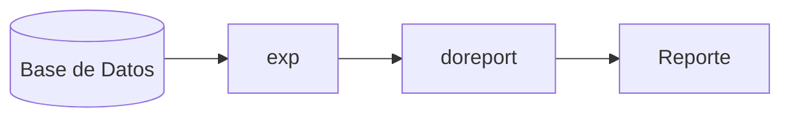

# Capítulo 17
# Reportes

En este capítulo se describen las capacidades de los reportes de IDEA-FIX, el lenguaje
utilizado para su definición (RDL) y los utilitarios que permiten manejarlos.
## Introducción
Los informes impresos (listados) son denominados en NILENGINE "reportes", terminología
tomada de la palabra inglesa reports.
NILENGINE permite diseñar reportes en forma muy simple, a fin de poder indicar aspectos tales
como:
- Características de los campos;
- Relación con Bases de Datos;
- Funciones como sumatorias y promedios;
- Cortes de control, y otros.
Los reportes pueden diseñarse con cualquier editor, pero es altamente recomendable el uso de
uno de los provistos por NILENGINE, ya que poseen ciertas características que facilitan mucho
esta tarea; siendo algunas de ellas imprescindibles, como por ejemplo la posibilidad de
escribir en español (vocales acentuadas, eñes, etc.) y carácteres gráficos.
Para definir un reporte se utiliza el RDL, o Report Definition Language (Lenguaje de
Definición de Reportes). El RDL permite dibujar la imagen del listado tal como se desea su
impresión, en un modo llamado WYSIWYG (What You See Is What You Get: lo que ves es lo
que obtienes), es decir que al ejecutar el programa, el listado se genera con el formato que se
le ha diseñado.
Cuando el archivo de definición del reporte está completo, se lo compila con rgen, el utilitario
de NILENGINE para generación de reportes.

## Generando Reportes
La especificación del reporte está contenida en un archivo con extensión ".rp", conocido como
archivo fuente RDL. Este se procesa con el utilitario rgen de NILENGINE, para generar un
archivo con extensión ".rpo".


Figura 4.1 - Generación de Reportes
```
graph LR
    A[arch.rp] --> B[rgen]
    B -.-> C[arch.rph]
    B -.-> D[arch.rpo]
```

La figura anterior muestra este proceso de generación, incluyendo en forma optativa crear
otro con extensión ".rph", este archivo contiene el reporte compilado. Este archivo es
utilizado tanto por el utilitario doreport como por un programa de aplicación escrito en "C",
en el momento de su ejecución.
El archivo de cabecera ".rph" debe incluirse en los programas de aplicación en "C" que
utilicen el reporte. Contiene valores de constantes simbólicas que representan los distintos
campos, y otras constantes auxiliares necesarias para la compilación.

## El Lenguaje RDL
Un archivo de especificación RDL se divide en tres secciones.
• La primera contiene la imagen del listado. En esta sección se dibuja el reporte, como se
desea que éste aparezca en la salida. La imagen se compone de campos del listado que se
llenan con la información provista por el usuario, y cadenas de carácteres constantes. Esta
sección comienza al principio del archivo, y en ella se describen las distintas zonas que
componen el listado.
• La segunda sección se inicia con la palabra clave %report. Se compone de sentencias que
terminan en punto y coma, dando información acerca de los requerimientos generales del
listado, tales como longitud del papel, esquemas de base de datos a utilizar, márgenes, destino
del reporte, etc.
• La tercera sección comienza con la palabra clave %fields y define los nombres de los
campos del listado y sus atributos.

## Imagen del Reporte
La imagen del reporte se divide en zonas del reporte que son líneas de detalle. Una zona del
listado tiene un nombre, y está formada por uno o más campos, o inclusive por ninguno. En el
diseño es posible imponer condiciones para definir cuándo debe imprimirse una zona.
La definición de una zona se inicia con un "%" seguida por su nombre, los nombres de los
campos de la zona, y opcionalmente por la condición para imprimirla. La figura muestra el
esqueleto de una especificación de reporte.

Figura 4.2 - Estructura de un Reporte
```
%nombre_zona([nombre_campo, ..]) [condicion]
Línea de Detalle

%nombre_zona(. . . . .)

%report
Sentencias para definiciones generales

%fields
nombre_campo: Atributos del campo
. . . . . . .
```

La salida del reporte se compone de páginas, cada una de las cuales se divide en zonas, tal
como se las dibuja en el archivo de definición (.rp). Sobre el dibujo de la zona se especifican
los campos que serán reemplazados por información.
La zona tiene un nombre, y se indican uno o más parámetros que son los valores a reemplazar
en los campos de la zona. Opcionalmente se puede especificar una condición que controla
cuándo se imprimirá la zona.
La sintaxis completa para definir una zona es:

```
%zoneX(expr [: expid], ...) ...
```

donde:
- **nombre**: es el nombre de la zona.
- **expr**: es una expresión completa que puede contener llamados a función y campos combinados
en expresiones aritméticas.
## Definiendo Expresiones
Las expresiones definen los valores que se imprimirán en los campos correspondientes de la zona.
También, una expresión puede ser identificada con un nombre, para ser referenciada
directamente por su nombre luego en el reporte.
Por ejemplo:

```
%zoneA (n1, n2, (n1+n2)*200 : b)
%zoneB ((runsum(b)+n1+n2)/800)
```

El id de la expresión (b, en este caso), también puede ser usado para tener dos entradas
distintas en la sección %fields, por ejemplo:

```
%zoneA(a : c1, a : c2)
________ _________
%fields
c1: atributos para c1;
c2: atributos para c2;
```
Los valores que conforman una expresión puede ser un campo de un reporte, un función, una
variable, una constante, o cualquier combinación de ellos. A continuación se presenta una
explicación detallada de cada valor:
## Funciones:

- **sum(param)**: Se imprimirá la suma de los valores que haya tomado param.
- **avg(param)**: Se imprimirá el promedio de los valores que haya tomado param.
- **count(param)**: Se imprimirá la cantidad de los valores que haya tomado param.
- **min(param)**: Se imprimirá el mínimo de los valores que haya tomado param.
- **max(param)**: Se imprimirá el máximo de los valores que haya tomado param.
- **runsum(param)**: Se imprimirá la suma de los valores que haya tomado el parámetro indicado,
a lo largo de todo el reporte.
- **runavg(param)**: Se imprimirá el promedio de los valores que haya tomado el parámetro
indicado, a lo largo de todo el reporte.
- **runcount(param)**: Se imprimirá la cantidad de valores que haya tomado el parámetro
indicado, a lo largo de todo el reporte.
- **runmin(param)**: Se imprimirá el mínimo de los valores que haya tomado el parámetro
indicado, a lo largo de todo el reporte.
- **runmax(param)**: Se imprimirá el máximo de los valores que haya tomado el parámetro
indicado, a lo largo de todo el reporte.
Las funciones runsum, runavg, runcount, runmin y runmax , se aplican cuando se desea
evaluar los valores que obtuvo un determinado parámetro hasta el momento en que se la
invoca.

Variables:
- Variables:
  - today~: Contiene la fecha corriente.
  - hour: Contiene la hora corriente.
  - pageno: Contiene el número de página.
  - lineno: Contiene el número de línea.
  - module: Contiene el nombre del módulo.
- Constantes:
  - Puede ser cualquier constante numérica: 1, 2, . . ., 50, . . .738, . . .
Para una mayor comprensión, tomaremos un nuevo ejemplo, que intenta abarcar la mayor
cantidad de variantes posibles. Para ello utilizaremos las siguientes tablas de un esquema
llamado personal:

```
table emp descr "Legajos del personal" {
empno num(4) not null
primary key,
nombre char(30)not null,
cargo num(1)
in cargos:descrip,
jefe num(4) in emp:nombre,
fingr date <=today,
sueldo num(12,2),
depto num(2) in depto:nombre
};
table depto descr "Departamentos" {
depno num(2) not null
primary key,
nombre char(20) not null
};
table cargos descr "Cargos de la Empresa" {
cargo num(2) not null
primary key,
descrip char(20) not null
};
```

Como ejemplo de utilización de funciones, remitimos al lector a la figura siguiente, en la cual
se define un reporte utilizando las tablas del esquema que acabamos de definir. Pero antes, a
los fines de un mejor aprovechamiento del espacio, dejamos ilustrada una consulta por iql,
consistente en el "query":

```
use personal;
select ~depto, nombre, sueldo, fingr
from ~emp, depto
where emp.depto = depto.depno
output to report ~personal;
```
Aquí se han representado en bastardilla los nombres y operandos variables que debe ingresar
el programador.

Figura 4.3 - Reporte con Funciones
```
%tit(pageno, today) before page
Página : __. Fecha: __/__/__
Listado de Empleados
====================
Depto. Empleado Sueldo Fecha Ingreso
========================================================
%linea(depto, nombre, sueldo, fingr)
__. __________________________ ___________. __/__/__
%suma(sum(sueldo)) after depto
Cálculos por departamento: -------------------------
Suma de sueldos por departamento : ___________.
%prom(avg(sueldo)) after depto
Promedio de sueldo por departamento : ___________.
%mini( min(sueldo) ) after depto
Mnimo sueldo del departamento : ___________.
%maxi(max(sueldo)) after depto
Máximo sueldo del departamento : ___________.
%totsuma( sum(sueldo) ) after report
Cálculos Totales: -------------------
Suma de los sueldos de la empresa : ___________.
%totprom( avg(sueldo) ) after report
Promedio de sueldo de la empresa : ___________.
%totmini( min(sueldo) ) after report
Sueldo mínimo de la empresa : ___________.
%totmaxi( max(sueldo) ) after report
Sueldo máximo de la empresa : ___________.
%report
use personal;
%fields
depto: ; nombre: ;
sueldo: ;
fingr: ;
```

Figura 4.4 - Listado cn Funciones
```
Página: 1 Fecha : 03/08/89
Listado de Empleados
====================
Depto. Empleado Sueldo Fecha Ingreso
========================================================
1 Juan Gatica 950 14/01/82
1 Hugo Riveros 1400 23/04/80
Cálculos por departamento:
-------------------------
Suma de sueldos por departamento : 2350
Promedio de sueldo por departamento : 1175
Mínimo sueldo del departamento : 950
Máximo sueldo del departamento : 1400
2 Charlie Parker 2600 23/06/87
2 Albert Colby 1150 07/08/92
Cálculos por departamento:
-------------------------
Suma de sueldos por departamento : 3750
Promedio de sueldo por departamento : 1875
Mínimo sueldo del departamento : 1150
Máximo sueldo del departamento : 2600
3 John Holmes 1000 27/08/84
Página: 2 Fecha : 03/08/89
Cálculos Totales:
-------------------
Suma de los sueldos de la empresa : 7100
Promedio de sueldo de la empresa : 1420
Sueldo mínimo de la empresa : 950
Sueldo máximo de la empresa : 2600
```

Nótese que se han usado expresiones simples (aquellas que sólo una referencia), para ver su
uso a continuación se presentan algunos ejemplos.
%zoneX ((runsum(b)+n1+n2)/8000)
Aquí, b, n1 y n2 pueden ser campos pertenecientes a la misma zona o a zonas previamente
definidas. Nótese que la definición de campos es un caso particular de esta sintaxis.
%zoneX(n)
%zoneY(a, b, a+b, sum(n), avg(n)*100)
En este caso, n es una expresión que retorna el valor de un campo n, a es una expresión que
retorna el valor del campo a, y lo mismo pasa con b. La expresión a+b retorna el valor de a y
de b, la expresión sum(n) retorna la sumatoria del campo n y la expresión avg(n)*100 retorna
el promedio del campo n por 100.
La expresión a+b permite realizar operaciones "horizontales" (esto es poner en una columna
la suma de otras dos) dentro de reportes.

## Opciones de Impresión
Las zonas de los reportes pueden ser impresas según condiciones que se indican junto con la
definición de las mismas.
### Cortes de Control

```
{before, after} {report, page, campo,
( [report] [,page] [,campo] [,...] )}
```

Estas opciones controlan aspectos de la impresión de una zona. Las condiciones before (antes)
y after (después) implementan cortes de control, que pueden ser efectuados según:
- **report**: El comienzo o fin del reporte. Esta opción puede usarse en conjunción con la page,
según se verá más adelante.
- **page**: El comienzo o fin de la página. Es de señalar que la opción before page no imprime la
zona en la primera página, en tanto que after page no lo hace en la última.
- **campo**: La impresión se realiza antes o después de que cambie el valor del campo
mencionado.
- **condiciones**: La zona se imprime cuando se cumpla un subconjunto de las condiciones de
corte. Es decir que si el conjunto de condiciones está formado por las opciones page, report y
campo, la zona se imprimirá cuando se cumpla cualquiera de las condiciones individuales o
cuando se cumplan dos o más simultáneamente. El conjunto de opciones puede estar formado
por varios campos, en cuyo caso la zona se imprimirá antes o después (before o after) del
cambio de valores de uno o más de ellos.
Un ejemplo de la aplicación de la combinación de opciones de corte de control, sería el caso
en que el programador necesitara imprimir una zona al comienzo de todas las páginas, la
primera inclusive, y otra al final de todas ellas, incluyendo la última. Si colocara simplemente
las opciones before report y after page no conseguiría esto, ya que en el primer caso no se
imprimiría la zona en la primera página y en el otro no se imprimiría en la última.
Combinando estas opciones con before page y after report de la manera apropiada, es posible
obtener el resultado deseado. Por ejemplo:

```
%zonaM( param [,...] ) before (page, report)
%zonaN( param [,...] ) after (page, report)
```
 
Por otro lado, u grupo de especificaciones como:

```
%zoneB1( param1 ) before page
%zoneB2( param1, param2 ) before report
%zoneB1( param3 ) after page
%zoneB2( param3, param4 ) after report
```

Los siguientes son algunos ejemplos de aplicación de las opciones de corte de control:

```
%titulo( today, hour, pageno ) before page
Fecha : __/__/__
Hora : __:__:__
Página : ___.
%total ( sum(sueldo) ) after (depto, seccion, report)
TOTAL : _,___,___.__
```

En el primer caso la zona se imprimirá antes de cada página, salvo la primera, y los campos
indicados tomarán los valores de las variables pasadas como parámetros. La segunda zona del
ejemplo se imprimirá cuando alguno de los parámetros depto y/o seccion cambien de valor o
bien termine el reporte. Si se diera el caso de que se cumplan dos o tres de las condiciones
simultáneamente la zona sólo se imprimirá una vez.
### Impresión Condicionada - if

if <param> <condicion> <param>

Esta opción permite controlar una determinada zona, de forma tal que si se cumple
<condicion>, se imprime la zona de impresión asociada.

%linea() if campo1 = campo2

es un caso simple. Usando expresiones sería de este tipo:

%zoneY(a, b) if a + 10 > b + sum(n)

de esta forma la opción if se torna más potente.
### Agrupación

group with zona

La opción group permite agrupar zonas para que sean impresas en la misma página. Por
ejemplo si una zona de totales desea ser impresa junto con otra de subtotales, para que dado el
caso no quede la zona de totales impresa en una hoja separada, debería especificarse:

```
%subtot(sum(sueldo)) after (depto, seccion, report)
Total : _,___,___.__
%total(sum(sueldo), max(sueldo), min(sueldo), avg(sueldo))
after report, group with subtot
Totales : _,___,___.__
Sueldo Máximo : _,___,___.__
Sueldo Mínimo : _,___,___.__
Sueldo Promedio : _,___,___.__
```
### Avance de página

```
eject {before, after}
```

La opción eject provoca un salto de página antes (eject before) o después (eject after) de
imprimirse la zona. Si no se especifica el momento, se obtendrá el mismo efecto que un eject
after. Esto equivale a decir que ÔafterÕ es el valor por defecto.

### Zonas no Impresas

```
no print
```
En ocasiones no se desea que una determinada zona sea impresa. Ello ocurre cuando se quiere
imprimir el nombre del mes de una fecha pasada como parámetro: es necesario ubicar la fecha
en alguna zona para que quede definido el tipo de dicho parámetro. En tal caso la fecha puede
estar definida en una zona no imprimible, de forma tal de no entorpecer el diseño del reporte.
Veamos un ejemplo:

```
%fecaux(fecha) no print __/__/__
%titulo( day(fecha), monthname(fecha), year(fecha) ) before
report
__. de _________ de _,___.
. . . . .
```

### Impresión en una posición fija

```
at line NN
```
La opción at line NN permite imprimir una zona siempre en la misma posición de la hoja.

    piepag(param1, ... ) at line 53

En este ejemplo la zona de "pie de página" piepag siempre se imprimirá a partir del renglón
53 de cada página del reporte. Es importante resaltar que el usuario es responsable de verificar
que las zonas previas no sobrepasarán el número de línea especificado: dado que el sistema no
interrumpirá la impresión de una zona que involucre varias líneas, en este caso el pie de
página aparecerá en una línea inferior (la primera disponible luego de que la zona previa este
completada).
Las expresiones pueden ser usadas incluyendo esta opción, como en

    %zoneZ(c, d) at line $PLINE + 1

Así mismo, las expresiones usadas en esta cláusula no podrán contener referencias a
expresiones definidas en una zona.
### Definición de Campos
Los campos de los listados se definen siempre dentro de las zonas, y se los especifica igual
que en los formularios. La única diferencia es que a los campos se les da un nombre dentro de
la especificación de la zona, y en la sección %fields, se especifican las características de los
mismos.
La expresión "\$varname" se reemplaza por el valor de la variable de ambiente varname. El
texto que aparecerá en la salida es el contenido de dicha variable de ambiente cuando se
imprime el reporte.

## La Sección %report
    use esquema [, esquema];
especifica el o los esquemas de la Base de Datos a utilizar. Por su parte las especificaciones

```
flength = <valor>; // Largo de página
topmarg = <valor>; // Margen superior
botmarg = <valor>; // Margen inferior
leftmarg = <valor>; // Margen izquierdo
[no] formfeed;
```

indican los valores para la longitud del formulario de papel (flength) y para los márgenes
superior, inferior e izquierdo de la página (topmarg, botmarg y leftmarg respectivamente). La
longitud de la línea se supone de 80 caracteres. Si se indica la opción formfeed, se cumplirán
los saltos de página al imprimir el reporte; en caso contrario el listado saldrá en forma
continua.
<valor> puede ser un número, o un valor que se toma del ambiente con una indicación
$varname. En este caso, el valor es aquel contenido en la variable de ambiente cuando se
imprime el listado. Los valores por defecto son:
Los valores por defecto son:

- **flength**: 66
- **width**: 80
- **leftmarg**: 0
- **topmarg**: 2
- **botmarg**: 2

```
output to {
archivo
| printer
| pipe comando
| terminal
| stdout
}
```

Esta sentencia permite la especificación del destino de la salida, que puede ser un archivo, la
impresora, otro comando, la terminal o la salida normal (standard output).

- **archivo**: Esta opción permite enviar los resultados del reporte a un archivo
- **printer**: Esta opción envía la salida del reporte al destino especificado en la variable de
ambiente printer (Consultar Manual del Usuario, Apéndice A). En el sistema operativo MS-
DOS, la variable de ambiente PRINTER podría estar definida de la siguiente forma:

    PRINTER = P:pm -o PRN

pipe command Si se usa esta alternativa, los resultados del reporte son enviados al proceso
indicado por el comando cmnd, sirviendo de input para la ejecución del mismo.
terminal La salida por terminal genera una ventana con los resultados del reporte, permitiendo
paginar vertical y lateralmente. La ventana generada tendrá tantas columnas como la línea
más ancha del reporte. La cantidad de columnas máxima de la ventana creada nunca excederá
el ancho de la terminal en uso, por lo tanto el usuario tendrá la posibilidad de paginar
lateralmente. El largo de ventana también se calcula automáticamente, en base a la longitud
de página definida en el reporte y la cantidad de filas disponibles en la terminal. En tal caso,
el usuario podrá paginar verticalmente.
stdout Esta opción envía los resultados del reporte a la salida estándar, tal como ésta esté
definida.
En caso de no especificarse esta cláusula se considera como salida la opción output to printer
(default value).

```
input from <fuente>;
<fuente>: <cadena>
| <variable_de_ambiente> [...]
| pipe <cadena>
| <variable_de_ambiente>
| terminal
```

Esta sentencia se utiliza cuando el reporte es utilizado por doreport, permitiendo definir de
dónde se leerá la entrada.
La primer opción de <fuente>, es utilizada para indicar la entrada mediante un archivo de
datos. Por ejemplo, si en el archivo datos, se tiene almacenada la información que debe ser
entrada al utilitario doreport, se puede especificar como:

```
input from "datos";
input from $datos;
```

haciendo primero referencia a un string de caracteres, y luego a una variable de ambiente; ésta
debe existir al momento de ejecución.
En cambio:

```
%report
use personal;
input from pipe "iql -b -c
select depto, nombre, sueldo, fingr
from emp, depto
where emp.depto = depto.depno
output delimited;"
```

se usa para indicar, mediante la especificación input from pipe(<dg>), que la entrada será la
salida de un comando, mientras que input from terminal utiliza la entrada estándar. Cuando
no está presente, doreport la emplea por defecto, siendo necesario indicar en el comando la
opción ``-d'', o cuál es la forma en que vienen separados los campos y los registros que entran
al utilitario doreport (<dg>). Finalmente, con la sentencia

    language "C";

se informa que el reporte será usado desde la interfaz de programación, de modo que cuando
sea procesado con el utilitario rgen se genere siempre el archivo de encabezamiento
(archivo.rph), sin necesidad de indicarlo explícitamente.
## La Sección %fields
Esta sección es semejante a la de un archivo de formulario. Pueden especificarse atributos
para cada nombre de los campos de una zona. El orden en que los campos se nombran en esta
sección, es aquel en el cual espera encontrarlos doreport.
La sintaxis de esta sección es una lista de los nombres de los campos seguidos por una lista
opcional de atributos:

```
campo: opciones;
```

La especificación de opciones está formada por una lista de sentencias separadas por comas,
que pueden ser:

<campo_tabla> Los atributos inherentes al campo en la especificación en la tabla de campos
de la base de datos a la que se hace referencia. Es factible especificar atributos adicionales o
derivados de otros ya existentes.
mask <cadena> Realiza una operación de máscara como el atributo mask definido en el
Capítulo II, (Descripción de Sentencias DDS - CREATE TABLE). Como ser:

```
%zoneX(a)
_____
%fields
a: mask ($MASK != null ? $MASK : "NNNN");
```

Nótese que esta expresión no puede contener referencias a expresiones definidas en una zona.
null zeros Aplicable solamente sobre campos numéricos. Si el campo tiene valor "0", se
dejará en blanco (" ") en lugar de imprimirlo.
Se explican a continuación las distintas sintaxis posibles, aplicables en cada caso a los
anteriores ítems.
<campo_tabla> La forma de especificarlo puede ser:

    esquema.tabla.campo

Esta es una especificación completa y definida. Se refiere a un campo de una tabla de un
esquema. Las restantes definiciones implican un cierto grado de ambigüedad.

    tabla.campo

La tabla debe pertenecer a uno de los esquemas activos, establecidos en la sentencia use. Se
utiliza la primera de ellas que concuerde con el nombre tabla.

    tabla.

Valen las consideraciones efectuadas para el caso anterior con respecto a tabla. El campo
usado es aquel con el mismo nombre que el del campo de la pantalla.
<cadena> Una cadena es cualquier conjunto de caracteres encerrado entre comillas dobles
(character string).

"Hola, mundo!"

<valor> Un valor puede ser cualquiera de los tipos válidos para las columnas de las tablas,
que son: numeric, character string, date, time, float o bool.
Las variables especiales today y hour corresponden a la fecha y hora corriente. Cualquiera sea
la cantidad de campos que se empleen con el utilitario doreport, el orden en que se especifican
debe coincidir con el orden en que fueron colocados para su impresión.

### Funciones y Variables

Cabe hacer las siguientes consideraciones con respecto al tipo de función (formato) que corresponde a cada una de las funciones permitidas en un reporte:

*   Las funciones son creadas dinámicamente; cada vez que aparece una función en la definición de un reporte, se crea un nuevo campo virtual. Esto permite que la misma función sea impresa con diferentes formatos.
*   Las funciones pueden ser usadas en expresiones (ej. `if a < sum(h)`). En este caso se le asigna un tipo interno (el cual está señalado con una "x" en la Figura 4.5), ya que el formato de impresión permanece indefinido. Cuando hay más de una "x", se elige el tipo que haga válida la expresión.
*   El tipo de una función está definido de dos formas:
    1.  Por el tipo seleccionado en la imagen del reporte.
    2.  Por el uso del mismo dentro de una expresión.

**Figura 4.5 - Funciones y Tipos Internos**

| DATE | TIME | CHAR | FUNCION | SHORT | LONG | DOUBLE |
| :---: | :---: | :---: | :--- | :---: | :---: | :---: |
| | | | **SUM** | x | x | x |
| | | | **AVG** | x | x | x |
| x | x | | **COUNT** | x | x | x |
| | | | **MIN** | x | x | x |
| x | x | | **MAX** | x | x | x |
| x | x | | **DAY-MONTH-YEAR** | x | x | x |
| | | | **DAYNAME** | | | |
| | | x | **MONTHNAME** | | | |
| | | x | **TODAY** | | | |
| x | | | **HOUR** | | | |

Las variables tienen un tipo fijo asignado y no puede ser modificado. La única opción posible es agregar *short* o *long* al valor numérico, como se puede observar en la siguiente tabla:

**Tabla de Variables y Tipos**

| Double | Date | Time | VARIABLE | Char | Short | Long |
| :---: | :---: | :---: | :--- | :---: | :---: | :---: |
| | | | **pageno** | | x | x |
| | | | **lineno** | | x | x |
| | | x | **today** | | | |
| | x | | **hour** | | | |
| | | x | **flength** | | x | x |
| | | | **botmarg** | | x | x |
| | | | **topmarg** | | x | x |
| | | | **leftmarg** | | x | x |
| | | | **width** | | x | x |

Para completar esta descripción, veamos un diagrama de compatibilidad entre las funciones y los tipos de argumentos que aceptan.

**Figura 4.7 - Funciones y Tipos de Argumentos Válidos**

| FUNCION | Double | Date | Time | | Char | Short | Long |
| :--- | :---: | :---: | :---: | :---: | :---: | :---: | :---: |
| **SUM** | | | | | | x | x |
| **AVG** | x | | | | | x | x |
| **COUNT** | x | x | x | | x | x | x |
| **MIN** | x | x | x | | | x | x |
| **MAX** | x | x | x | | | x | x |
| **DAY** | x | x | x | | | | |
| **MONTH** | | x | | | | | |
| **YEAR** | | x | | | | | |
| **DAYNAME** | | x | | | | | |
| **MONTHNAME** | | x | | | | | |

**Definición del tipo de un campo:**

1.  Si se lo va a imprimir y no está definido aún, se le asigna el tipo de diseño de impresión (si es compatible en caso de ser una función).
2.  Si ya tiene un tipo definido, pueden darse los siguientes casos:
    *   **Son iguales:** no existen problemas. Es el caso de una función con un solo lugar donde imprimir.
    *   **Son distintos** (ocurre cuando un campo debe imprimirse en distintos lugares):
        *   Válido sólo en los casos numéricos.
        *   Si hay decimales deben coincidir entre la definición original (p. ej., la Base de Datos) y el diseño de impresión.

**Expresiones:**

*   Si ambos campos están definidos, se verifica la compatibilidad.
*   Si está definido uno solo, se define al otro de ese mismo tipo.
*   Si ambos campos se hallan indefinidos, se produce ERROR.

## Interfaz entre la Base de Datos y los Reportes

**Figura 4.8 - Correspondencia de Tipos: BD/Reporte**
| BASE de DATOS | REPORTE |  | Char | Numeric | Time |
| --- | --- | --- | --- | --- | --- |
| Date | Float | **CHAR** | x |  |  |
|  |  | **NUMERIC** | x **ᵃ** | x |  |
|  |  | **TIME** |  |  | x |
|  |  | **DATE** |  |  |  |
| x |  | **FLOAT** |  |  |  |
|  | x | **BOOL** | x |  |  |

---

### Notas de la tabla:

* **Ejes:** La tabla cruza los tipos definidos en la Base de Datos y el Reporte (izquierda) con las categorías de salida (derecha).
* **Referencia ᵃ:** He incluido la letra "**a**" en superíndice en la intersección de NUMERIC/Char tal como aparece en el original.
* **Marcas (x):** Se han ubicado siguiendo la cuadrícula de la imagen para asegurar la correspondencia técnica.
Debe tenerse en cuenta que:
- La longitud del campo en el reporte puede ser cualquiera.
- En caso de que se halla indicado la opción "-w" al efectuar la compilación del reporte con el
utilitario rgen, se avisa si los decimales no coinciden.

## Listado Ejemplo
El listado debe dar para cada departamento una lista de sus miembros, imprimiendo el nombre
del empleado y la fecha de ingreso. Se desea también, al final del listado, la cantidad total del
"staff" de la empresa. La figura muestra un listado que tiene esas especificaciones, y está
almacenado en un archivo llamado emplo.rp.

```
%reptitulo() before report
LISTADO DEL PERSONAL
====================
%pgtitulo(pageno) before page
Listado del Personal Page: ____.
===========================================
%dep(dnum,ddes) before dnum
Departamento: __. _________________________
NUMERO NOMBRE INGRESO
%person(pnum,pnombre,pfingr)
_____ _______________________ __/__/__
%tot(count(pnum)) after report
===========================================
Total Staff : _____. Empleados.
%report
%fields
dnum;
ddes;
pnum;
pnombre;
pfingr;
```
Figura 4.9 - Listado Simple

El listado se compila con el utilitario rgen:
    $ rgen emplo.rp
Una vez que el listado fue compilado, se lo puede correr con doreport. Pero se le debe
preparar una entrada en ASCII. Es fácil de lograr con la sentencia SELECT del iql. Para eso
se prepara un archivo llamado list.sql con los comandos que siguen:

    use personal;
    select depno, depto.nombre,
    empno, emp.nombre, fingr
    from emp, depto
    where emp.depto = depto.depno
    order by depno
    output delimited;

Se puede ver que la sentencia SELECT lista todos los empleados ordenados por número de
departamento. De esta forma, cuando cambia el valor de depno se satisface la condición
before dnum, y se imprime el encabezamiento. La estructura del registro tiene los campos en
el orden que los espera el listado, en el orden especificado en la sección fields.
El listado se obtiene con los siguientes comandos:

    $ iql list.sql | doreport emplo

En primer lugar se invoca al utilitario iql, pasándole como parámetro un archivo que contiene
sentencias DMS (Data Manipulation Statements). Mediante el símbolo "|" (pipe) se indica que
la salida que se obtenga del comando se tome como entrada del proceso que le sigue. En
nuestro caso, los resultados arrojados al ejecutarse las sentencias incluidas en el archivo
"list.sql" serán tomados por el utilitario doreport como parámetros del reporte. En el sistema
operativo MS-DOS esta es la forma de simular las opciones input from pipe y output to pipe,
de las especificaciones generales del reporte.
La salida impresa se muestra en el siguiente gráfico:


```
LISTADO DEL PERSONAL
====================
Listado del Personal al 03/01/88 Pag: 1
>=============================================
Departamento: 1 Desarrollo
NUMERO NOMBRE INGRESO
1 Juan Gatica 01/03/88
4 Hugo Riveros 01/04/86
Departamento: 2 Software de Base
NUMERO NOMBRE INGRESO
2 Charlie Parker 03/12/60
5 Albert Colby 03/11/70
Listado del Personal al 03/01/88 Pag: 2
==============================================
Departamento: 3 Documentación
NUMERO NOMBRE INGRESO
9 John Holmes 25/02/75
3 Sam Pepper 25/02/75
7 Peter Pan 30/10/66
Departamento: 4 Administración
NUMERO NOMBRE INGRESO
6 Piccolino Capri 11/09/87
===========================================
Total del Personal: 8 Empleados
```
Figura 4.10 - Listado de Salida

Otra opción, es incluir en la sentencia de iql, a qué report se debe direccionar la salida:

```
use personal;
select depno, departamento.nombre,
empno, emp.nombre, fingr
from emp, depto
where emp.depto = depto.depno
order by depno
output to report "emplo";
```

Nótese que el nombre del reporte no necesita llevar la extensión ".rp", dado que será asumida
por el sistema. Con este cambio, el listado será producido por el comando:

    $ iql list.sql


## Usando Reportes
- Mediante el utilitario "doreport" de NILENGINE.
- Desde un programa de aplicación en lenguaje "C", mediante rutinas de manejo de reportes,
provistas por la biblioteca de NILENGINE.
- Direccionando la salida de una sentencia SELECT de IQL.
Se verá a continuación cuales son los métodos existentes.

## DOREPORT
Doreport es un utilitario que lee una secuencia de registros de datos por su entrada estándar.
Esos datos son los que alimentan la definición del reporte que se le pasa como parámetro.
Se indica de donde tomará la entrada de datos especificándolo en la sección "%report" de la
definición del reporte (ver Lenguaje RDL).
Este utilitario trabaja como un filtro, lee su entrada, la formatea, y escribe el resultado en la
salida. La entrada debe ser en ASCII, admitiendo distintos formatos de delimitación de
campos, en forma similar a los utilitarios imp y exp (ver Capítulo 2 - Usando Bases de Datos
/Utilitario export-import).
Esto permite generar reportes en forma sumamente rápida y sencilla a través de la
combinación de estos utilitarios como muestra la figura:




Para poder trabajar en forma correcta con este utilitario debe asegurarse que el orden de los
campos en el lote de datos de entrada es el que se ha definido en el reporte.
La forma de utilizar doreport es la siguiente:

    a) $ doreport -Fc -Rc reporte

Mediante estas opciones se indica que:
Rc: Define a c como el carácter separador de registros. Por defecto es el carácter "newline"
(\n).
Fc: Define a c como el carácter separador de campos. Por defecto es la coma (,).

    b) $ doreport -d reporte

-d Mediante esta opción se indica que se toman los delimitadores de campos y registros como
los estándares, es decir que se espera como separador de campos a las "," y al de los registros
al "\n".

    c) $ doreport reporte param1 param2 ...

Los parámetros que se pasan al utilitario serán tomados como valores que saldrán impresos en
el reporte en el lugar donde se lo haya referenciado en el archivo de especificación del reporte
con \$1, \$2, etc..

    d) $ doreport -nNN reporte

    Emite NN copias del reporte.

## Interfaz C
Las distintas aplicaciones con reportes pueden ser desarrolladas mediante la aplicación del
utilitario "doreport" y con las instrucciones del ``iql'', al cual se ha hecho referencia en este
mismo capítulo.
En caso de que algún requerimiento no pueda ser satisfecho con las herramientas antes
mencionadas, puede recurrirse a la Interfaz de Programación (ver Capítulo 1, de Referencia
del Programador). Esta permite el desarrollo de reportes de distinto nivel de complejidad,
para cualquier aplicación. La Biblioteca de NILENGINE posee un subconjunto de funciones para
manejo de reportes, entre las cuales se destaca la función DoReport. Esta función junto con
las funciones DbToRp, RpSetFld y otras, permiten el desarrollo de las aplicaciones antes
mencionadas.
La función DoReport, es la que produce la salida de una zona que se haya definido en el
archivo de especificación del reporte. En caso de que dicha zona contenga campos, debe
haberse dado valores a los mismos mediante la función RpSetFld o alguna de sus variantes.
Ellas tienen por función específica la asignación de contenidos a los distintos campos
definidos en el reporte, existiendo una variante de "Set field" para cada tipo de formato (float,
date, time, char, etc.).
DbToRp (Data base to Report) copia valores de una tabla de la base de datos a los campos del
reporte que se le indiquen.
Para tener más información de estas funciones remitirse a al parte II de este manual.
En un programa en lenguaje "C" desarrollado para trabajar con un reporte, también puede ser
utilizada la función DoForm en caso de que se esté utilizando una pantalla para referenciar la
información que se desea esté contenida en el reporte. Por ejemplo, asociar una pantalla a un
reporte para que ciertos datos de la pantalla se impriman en el reporte. Se puede obtener más
información sobre ésto en la sección Generador de Formularios.
Por ejemplo, si se quiere obtener un listado, de los empleados con el siguiente formato:


```
%tit(pageno, today) before page
Página: __.
Fecha : __/__/__
Listado de Empleados
======================
Depto. Empleado Sueldo F. Ingreso
========================================================
%linea(rdepto, nombre, sueldo, fingr)
__. ____________________________ _______,__. __/__/__
%report
use personal;
%fields
rdepto: emp.depto;
nombre: emp.;
sueldo: emp.;
fingr : emp.;
```
Figura 4.12 - Especificación de Reporte

Se puede obtener mediante el acceso a los datos pertinentes con las sentencias del iql o el
doreport, utilizando a éste último como formateador.


```
/*****************************************************
* DENOMINACION:Listado de Empleados *
*PANTALLAS:No se usan *
*REPORTES:rep.rp *
******************************************************/
#include <nilengine.h>
#include "rep.rph"
#include "personal.sch"
wcmd (rep, 1.1 08/08/89)
{
    report rp;
    rp = OpenReport("rep", RP_EABORT);
    while(GetRecord(EMP,NEXT_KEY, IO_NOT_LOCK)!=ERROR){
        DbToRp(rp, RDEPTO, FINGR);
        DoReport (rp, LINEA);
    }
}
```
Figura 4.13 - Programa en "C"para manejo de Reportes


Este no es un caso de gran complejidad, pero su objeto es mostrar un ejemplo de programa
desarrollado en "C", empleando algunas de las funciones de la biblioteca de interface de
NILENGINE para obtener el listado.
Como se ve, en el programa se deben incluir los archivos cabecera resultantes de compilar el
reporte rep.rp con la opción "-h" del rgen, habiendo creado el archivo cabecera del esquema.
Mediante este programa se abre un reporte, y por cada registro de datos obtenido se realiza la
transferencia de dichos datos desde el buffer de la base de datos al área del reporte; luego,
mediante la función DoReport, se provoca la salida al destino indicado mediante la variable
de ambiente printer, que puede ser un device o un archivo. Remitimos al lector al capítulo de
Funciones para comprender el funcionamiento de cada una de las que se han utilizado en esta
porción de código. El listado tendría el siguiente aspecto:


```
Página: 1
Fecha : 23/08/92
Listado de Empleados
======================
Depto. Empleado Sueldo F. Ingreso
=====================================================
1 Juan Gatica 1900,00 01/03/88
1 Hugo Riveros 1090,00 01/04/86
2 Charlie Parker 900,00 12/10/60
2 Albert Colby 1550,00 11/03/70
3 John Holmes 1000,00 25/02/75
Página: 2
Fecha : 23/08/92
Listado de Empleados
======================
Depto. Empleado Sueldo F. Ingreso
=====================================================
3 Sam Pepper 1350,00 25/02/75
3 Peter Pan 1200,00 30/10/66
3 Piccolino Capri 1200,00 09/11/87
```
Figura 4.14 - Ejemplo de Impresión de Reporte
## Capacidades Máximas del Sistema

| Descripción de Capacidad | Valor Límite |
| --- | --- |
| Número de Reportes abiertos simultáneamente | 8 |
| Número de Esquemas abiertos simultáneamente | 4 |
| Carácteres en un campo alfanumérico | 65535 |
| Dígitos en un campo numérico | 15 |
| Dígitos significativos en un campo numérico | 15 |
| Rango de valores en un campo fecha | 16/04/1894 to 16/09/2073 |
| Rango de valores en un campo hora | 00:00:00 to 23:59:58 **ᵃ** |
| Nombres de Esquema (longitud) | 10 |
| Nombres de Tabla (longitud) | 10 |
| Nombres de Campo | Unlimited |
| Campos por Reporte | 128 |
| Zonas por Reporte | 128 |

